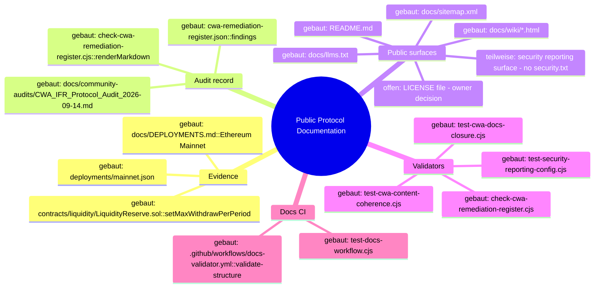

# Architecture Map — Public Protocol Documentation

Scope of this map: the documentation-evidence trail that T-116 works on.
It covers one node of the Inferno repository — **Public Protocol Documentation** —
and the single hop that carries a community-audit finding from on-chain/source
evidence to a published surface and back into CI.

It is deliberately **not** a map of the whole repository. Contracts, backends,
wallets, runtime configuration and deployment tooling are neighbours of this
trail; they are named where the trail reads them, and nothing more.

## 1. Grundidee

- Inferno ($IFR) is a deflationary ERC-20 protocol on Ethereum Mainnet whose
  public claims must stay provably equal to deployed source and chain state
  (`README.md`, `docs/WHITEPAPER.md`).
- Community auditors publish findings as immutable reports
  (`docs/community-audits/CWA_IFR_*_2026-09-14.md`); their text and severity
  labels are historical record and are never edited.
- A machine-readable register carries the *current* disposition of each finding
  (`docs/community-audits/cwa-remediation-register.json`), and a generated
  Markdown view mirrors it (`docs/community-audits/CWA_REMEDIATION_REGISTER.md`).
- Public surfaces (README, `docs/**`, wiki HTML, `docs/llms.txt`, copilot
  knowledge) repeat the register's totals and the underlying claims.
- Validator scripts under `scripts/` assert that surface text, register
  disposition and the underlying source/deployment evidence agree.
- Docs CI (`.github/workflows/docs-validator.yml`) is the gate: a claim that no
  validator can prove is not closed.

Boundary: this node changes **documentation, register data and validators
only**. It never changes contracts, backend behaviour, auth, wallets, runtime
config or deployments.

## 2. Spur (the one path a finding travels)

`Datei::Symbol → Datei::Symbol`, with the datum that crosses the edge:

1. `contracts/liquidity/LiquidityReserve.sol::setMaxWithdrawPerPeriod`
   → `docs/community-audits/CWA_IFR_Protocol_Audit_2026-09-14.md::[CWA-15]`
   — datum: the cap is an `onlyOwner` parameter, not an invariant.
2. `docs/DEPLOYMENTS.md::Ethereum Mainnet` → `deployments/mainnet.json`
   — datum: the 14 mainnet contract addresses plus documented provenance.
3. `docs/community-audits/CWA_IFR_*_2026-09-14.md::[CWA-nn]`
   → `docs/community-audits/cwa-remediation-register.json::findings[]`
   — datum: `severity` (frozen) and `disposition` (current).
4. `cwa-remediation-register.json::expectedDispositionTotals`
   → `README.md`, `docs/community-audits/README.md`, `docs/wiki/open-audit.html`,
   `docs/wiki/security.html`, `docs/CURRENT_FUNCTIONALITY_STATUS.md`,
   `docs/llms.txt`, `apps/ai-copilot/src/context/ifr-knowledge.ts`
   — datum: the "N fixed and verified / M open actionable" status markers.
5. `cwa-remediation-register.json` → `CWA_REMEDIATION_REGISTER.md`
   via `scripts/check-cwa-remediation-register.cjs::renderMarkdown`
   — datum: the generated register view (rebuilt with `--write`).
6. Public surfaces → `scripts/check-cwa-remediation-register.cjs`,
   `scripts/test-cwa-content-coherence.cjs`,
   `scripts/test-cwa-docs-closure.cjs`,
   `scripts/test-security-reporting-config.cjs`,
   `scripts/test-wiki-jsonld.cjs`, `scripts/test-content-trust.cjs`
   — datum: assertion that surface text still matches source and register.
7. `scripts/*.cjs` → `package.json::scripts` → `.github/workflows/docs-validator.yml`
   — datum: the executable command set.
8. `.github/workflows/docs-validator.yml` → `scripts/test-docs-workflow.cjs`
   — datum: the workflow contract (watched paths and required commands),
   so a validator cannot be silently dropped from CI.

## 3. Module

| Modul | Eine Aufgabe | Einstieg | Stand |
| --- | --- | --- | --- |
| Protocol source evidence | Hold the deployed truth a claim is checked against | `contracts/liquidity/LiquidityReserve.sol::setMaxWithdrawPerPeriod` | gebaut |
| Deployment evidence | Record which contracts are live and how they got there | `docs/DEPLOYMENTS.md::Ethereum Mainnet` | gebaut |
| Deployment manifest | Machine-readable mainnet address/provenance map for tooling | `deployments/mainnet.json` | gebaut |
| Community audit reports | Immutable finding text and original severity | `docs/community-audits/CWA_IFR_Protocol_Audit_2026-09-14.md` | gebaut |
| CWA register | Current disposition and totals per finding | `docs/community-audits/cwa-remediation-register.json::findings` | gebaut |
| Register renderer | Generate the Markdown register view from the JSON | `scripts/check-cwa-remediation-register.cjs::renderMarkdown` | gebaut |
| Public surfaces (repo docs) | State the protocol's claims to readers | `README.md`, `docs/*.md` | gebaut |
| Public surfaces (wiki/AI anchors) | State the same claims to browsers and AI crawlers | `docs/wiki/*.html`, `docs/llms.txt`, `docs/sitemap.xml` | gebaut |
| Security reporting surface | Publish how to report a vulnerability | `SECURITY.md`, `docs/SECURITY_POLICY.md`, `.github/ISSUE_TEMPLATE/config.yml` | teilweise |
| Docs validators | Assert surface == evidence == register | `scripts/check-cwa-remediation-register.cjs` | gebaut |
| Docs CI | Run the validator set on every docs change | `.github/workflows/docs-validator.yml::validate-structure` | gebaut |
| Workflow contract guard | Keep CI from dropping a validator | `scripts/test-docs-workflow.cjs` | gebaut |

`teilweise` for the security reporting surface: private reporting guidance and
the truthful "no bug bounty" statement exist and are guarded, but no
`security.txt` is published on any host (CWA-22).

## 4. Verdrahtung

- Contract source and the deployment record supply the only values a public
  surface is allowed to state; a value with no such origin does not get written.
- The audit report supplies a finding's identity and frozen severity; the
  register supplies its current disposition, and the two are cross-checked by
  `check-cwa-remediation-register.cjs`.
- The register's `expectedDispositionTotals` is the single source of the status
  markers on all seven public surfaces; a disposition change is therefore a
  seven-file edit plus a regenerated Markdown view.
- Each closed finding is pinned by at least one validator assertion, so the
  claim cannot drift back without turning Docs CI red.
- `package.json::scripts` is the only place a validator becomes a command, and
  `test-docs-workflow.cjs` asserts every such command is wired into Docs CI.

## 5. Widerspruch und Lücken

- **Widerspruch (CWA-21, open):** `contracts/**` carry `SPDX-License-Identifier:
  MIT`, `README.md` states "All rights reserved", and no `LICENSE` file exists.
  Both lines stand; picking one is a repository-owner and legal decision, not a
  documentation edit. Not resolved here.
- **Lücke (CWA-81, partial):** `web3.ifrunit.tech` serves its own `llms.txt`,
  `sitemap.xml` and `robots.txt`, and none of them are tracked in this
  repository. The apex host's anchors under `docs/` are in scope; the web3
  host's copies cannot be fixed from here.
- **Lücke (CWA-20, partial):** the drift cluster spans surfaces that are
  off-repo (Etherscan token info text) or not derivable from repository
  evidence (multisig signer naming). Only repo-verifiable members are closed.
- **Lücke:** `scripts/docs-sitemap-meta-generator.js` writes
  `NeaBouli.github.io/inferno` URLs into `docs/sitemap.xml` and is wired to no
  npm script. It contradicts the published sitemap. Left untouched — it is not
  on this hop.
- `deployments/sepolia.json` is the testnet twin of the manifest node and is out
  of scope for the mainnet-manifest finding.

## 6. Diagrammdateien

- `docs/architecture/MAP.md` (this file)
- `docs/architecture/map.puml` (mindmap + component diagram)
- `docs/architecture/main-path.puml` (sequence diagram of the trail above)

`plantuml` is not installed in this worktree, so no SVG was rendered. The
mindmap is repeated below as a Mermaid diagram so it is readable without
PlantUML.

## 7. Nächster Schritt

One module, one hop: **CWA register → public surfaces → validators**, for
CWA-15/20/21/22/23/51/52/53/81 only.

Files this hop may touch: `README.md`, `docs/DOCS.md`,
`docs/wiki/{security,transparency,integration,vesting}.html`,
`docs/sitemap.xml`, `docs/builder.html`, `docs/.well-known/security.txt`,
`SECURITY.md`, `docs/SECURITY_POLICY.md`, `deployments/mainnet.json`,
`docs/community-audits/cwa-remediation-register.json` (+ generated Markdown),
the seven status-marker surfaces, `scripts/test-cwa-docs-closure.cjs`,
`scripts/test-security-reporting-config.cjs`, `scripts/test-docs-workflow.cjs`,
`package.json` and `.github/workflows/docs-validator.yml`.

Files that stay untouched: everything under `contracts/`, `apps/*/server`,
`apps/points-backend`, `backend/`, `indexer/`, `infra/`, `tasks/`, wallet and
auth code, runtime configuration and every deployment script. Audit report text
and original severity labels are not edited.
