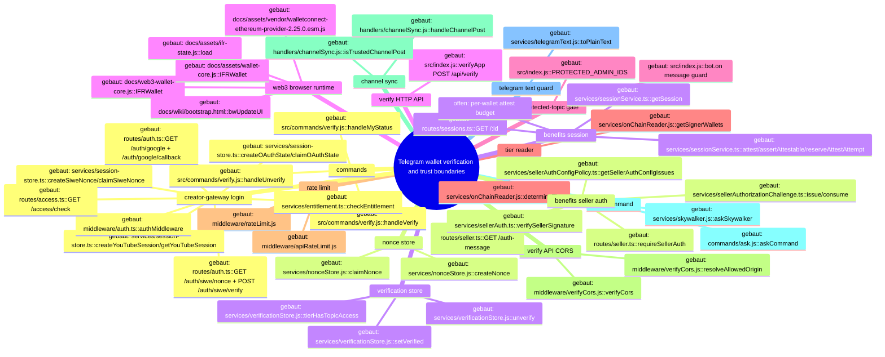
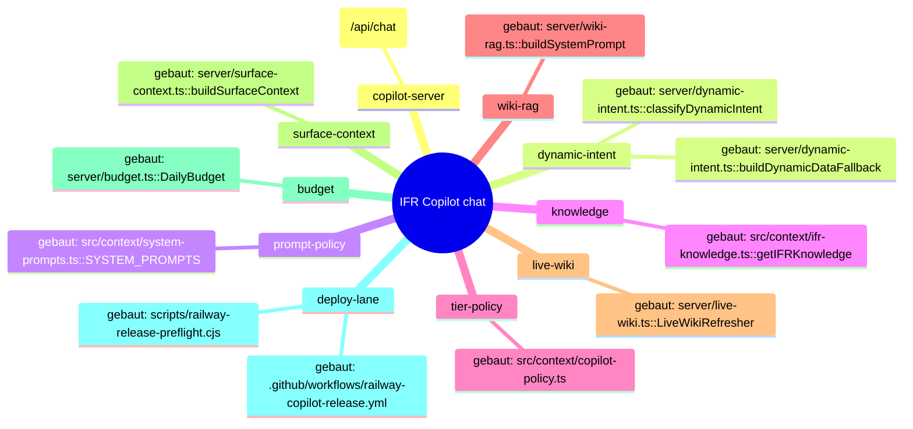
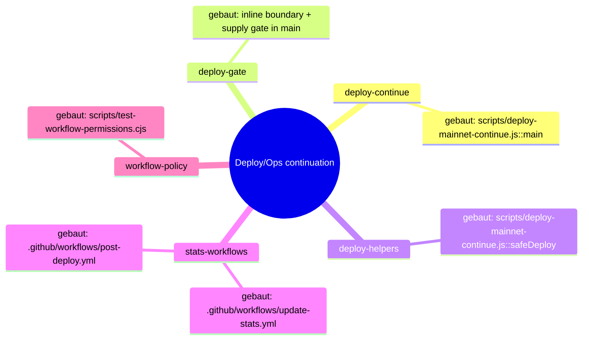
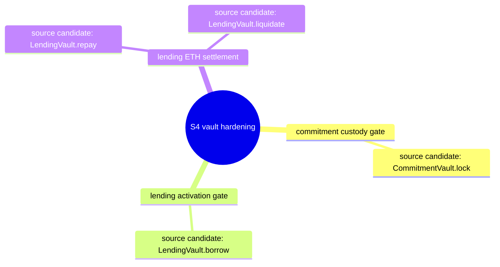
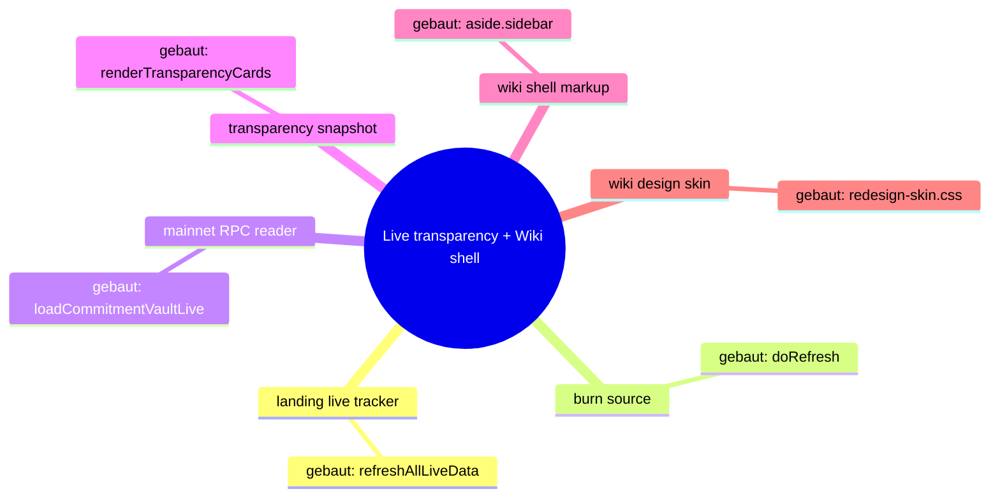
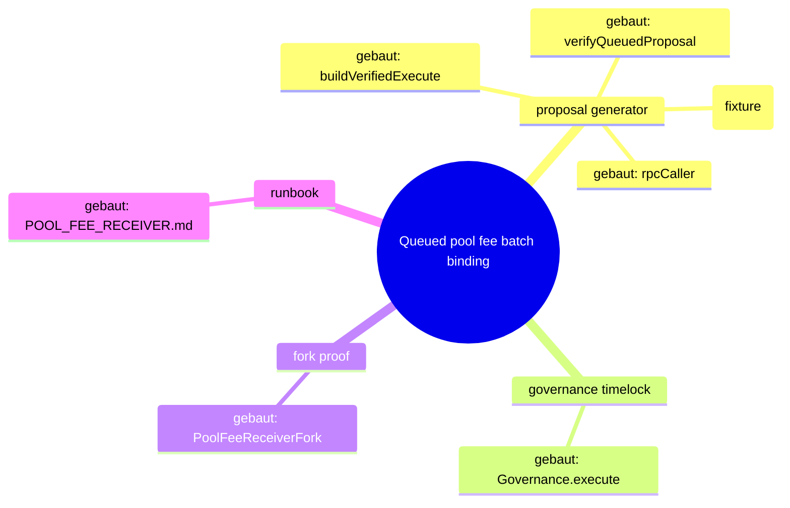

# Architecture Map — Security Traces

Scope: the verification/authorization trace and the privilege/CORS/content-trust
traces inside `apps/telegram/telegram-bot` (tasks
INFERNO-SECURITY-S2A-TELEGRAM-STATUS-20260926,
INFERNO-SECURITY-S2B-TELEGRAM-IDENTITY-20260926 and
INFERNO-SECURITY-S2C-TELEGRAM-TRUST-20260926, integrated on one base), and the
Creator Gateway login trace inside `apps/creator-gateway` (task
INFERNO-SECURITY-S2D-CREATOR-AUTH-20260926), and the Benefits seller
authorization/session trace inside `apps/benefits-network/backend` (task
INFERNO-SECURITY-S2E-BENEFITS-SELLER-AUTH-20260927), and the shared Web3
browser runtime trace `docs/web3/index.html` → `docs/web3-wallet-core.js` /
`docs/assets/wallet-core.js` → `docs/assets/ifr-state.js` → Web3 status
renderers (task INFERNO-SECURITY-S2F-WEB3-RUNTIME-20260927).
It also maps the Points voucher issue/validation trace inside `apps/points-backend`
(task INFERNO-SECURITY-S2G-POINTS-CWA14-20260927).
It also maps the IFR Copilot chat trace inside `apps/ai-copilot` (task
INFERNO-COPILOT-DYNAMIC-DATA-GUARD-20260924, section 8) and the Deploy/Ops
mainnet continuation trace (task T-137 S3 hardening, section 9).
The rest of the repository is intentionally unmapped.

## 1. Grundidee

The IFR Telegram bot gates protected forum topics (Core Dev, Council, Vote, Dev & Builder)
by binding a Telegram account to an Ethereum wallet: the bot issues a single-use nonce in
private chat, the user signs it on `ifrunit.tech/wiki/verify.html`, and the bot's Express
API checks the signature and stores the binding (`apps/telegram/telegram-bot/README.md`,
`apps/telegram/telegram-bot/src/index.js`). A per-message guard in protected threads then
allows or deletes messages based on the wallet's on-chain tier
(`apps/telegram/telegram-bot/src/services/verificationStore.js`,
`apps/telegram/telegram-bot/src/services/onChainReader.js`).

The same bot publishes generated or external content into the community (`/ask` AI
answers, channel → community sync with auto-pin). Both directions — privilege granting
and content publishing — fail closed: no hardcoded fallback identities, no substring
origin checks, no untrusted markup, no pins of untrusted channel content
(`src/index.js`, `src/services/onChainReader.js`).

## 2. Spur (Hop-Liste)

Verification/authorization trace:

1. `src/index.js::bot.command('verify')` → `src/commands/verify.js::handleVerify` — Daten: Telegraf `ctx` (userId, chat type)
2. `commands/verify.js::handleVerify` → `services/nonceStore.js::createNonce` — Daten: userId → nonce string
3. Browser (verify.html) → Traefik (TLS, ein Proxy-Hop, trusted via `VERIFY_TRUST_PROXY`) → `src/index.js::verifyApp POST /api/verify` — Daten: `{ nonce, signature, wallet }` + client IP via X-Forwarded-For
4. `src/index.js::POST /api/verify` → `services/nonceStore.js::claimNonce` (atomar vor jedem await) + `services/verificationStore.js::setVerified` — Daten: nonce → userId; binding userId → wallet
5. `src/index.js::POST /api/verify` → `services/onChainReader.js::determineTier` — Daten: wallet → tier (signer/voter/builder/community)
6. group message → `src/index.js::protected-topic guard (bot.on('message'))` → `services/verificationStore.js::{getWallet, reverifyFromMap}` + `services/onChainReader.js::determineTier` + `services/verificationStore.js::tierHasTopicAccess` — Daten: userId, threadId → allow/delete
7. `src/index.js::bot.command('unverify')` → `src/commands/verify.js::handleUnverify` → `services/verificationStore.js::unverify` — Daten: userId → binding removed
8. `commands/verify.js::handleMyStatus` → `services/verificationStore.js::{getUser, hasTopicAccess}` — Daten: userId → display only, no authorization

Trust-boundary trace:

1. config (`ADMIN_USER_IDS`, `SIGNER_WALLETS`, Safe RPC) →
   `src/index.js::PROTECTED_ADMIN_IDS` + `src/services/onChainReader.js::getSignerWallets` —
   Daten: env/on-chain owners → admin bypass list / signer tier set. Missing
   config or RPC failure yields an empty set (fail closed), never a hardcoded identity.
2. browser `Origin` header → `src/middleware/verifyCors.js::verifyCors` →
   `src/index.js::verifyApp` — Daten: origin string → exact allowlisted
   `Access-Control-Allow-Origin` or none. Requests without an Origin header are
   processed as non-browser API clients and receive no CORS headers.
3. `channel_post` update → `src/handlers/channelSync.js::handleChannelPost` →
   `ctx.telegram.sendMessage` + `pinChatMessage` — Daten: channel text →
   plain-text community message, pinned. Only the explicitly configured
   `TELEGRAM_CHANNEL_ID` source is trusted; forwarded/spoofed/missing source
   metadata fails closed.
4. `/ask` command → `src/commands/ask.js::askCommand` →
   `src/services/skywalker.js::askSkywalker` →
   `src/services/telegramText.js::toPlainText` → `editMessageText` — Daten:
   LLM answer string → plain-text Telegram message ≤ 4096 chars, no parse_mode.

Creator Gateway login trace (`apps/creator-gateway`):

1. browser (+ optional SIWE bearer JWT) → `src/routes/auth.ts::GET /auth/google` →
   `src/services/session-store.ts::createOAuthState` + HttpOnly/SameSite=Lax
   initiator cookie (`cg_oauth`, Secure in production) — Daten: wallet only from
   the verified bearer (query/body wallet rejected as untrusted input) → opaque
   single-use state + stored verifier hash (CSPRNG, 10-min TTL)
2. Google redirect → `src/routes/auth.ts::GET /auth/google/callback` →
   initiator-cookie check + `src/services/session-store.ts::claimOAuthState`
   (single-use, expiry-checked, verifier hash must match — missing-cookie,
   cross-session, replay and expired attempts all fail),
   `oauth2Client.getToken` and `src/services/session-store.ts::createYouTubeSession`
   → `issueJwt` — Daten: state → stored wallet; Google tokens → server-side
   session (1h TTL); JWT carries only `{ walletAddress?, sid }`
3. browser → `src/routes/auth.ts::GET /auth/siwe/nonce` →
   `src/services/session-store.ts::createSiweNonce` — Daten: → hex nonce
   (single-use, 10-min TTL)
4. browser → `src/routes/auth.ts::POST /auth/siwe/verify` →
   `SiweMessage.verify({ signature, domain, time })` with exact URI/chain-ID
   checks and `src/services/session-store.ts::claimSiweNonce` → `issueJwt` —
   Daten: message + signature → JWT `{ walletAddress }`
5. API request → `src/middleware/auth.ts::authMiddleware` (pinned HS256 verify)
   → `src/routes/access.ts::GET /access/check` →
   `src/services/session-store.ts::getYouTubeSession` +
   `src/services/entitlement.ts::checkEntitlement`
   (`services/lock-checker.ts` on-chain, `services/youtube-checker.ts` with the
   server-held token) — Daten: JWT claims → granted/reasons

Benefits seller authorization/session trace (`apps/benefits-network/backend`):

1. seller client (frontend `lib/api.ts::getSellerAuthMessage`, SDK
   `benefits.ts::requestSellerChallenge`) → `src/routes/seller.ts::GET /auth-message`
   (`challengeRateLimiter`) → `services/sellerAuthorizationChallenge.ts::issueSellerAuthorizationChallenge`
   — Daten: action, businessId, walletAddress, scope (`read` for reads) → 32-byte
   CSPRNG nonce row (bounded expired-row prune) + message with `Domain`, `Chain ID`,
   `Expires` from `config.ts` (`SELLER_AUTH_DOMAIN`, `CHAIN_ID`)
2. seller request (`x-ifr-wallet/-signature/-timestamp/-nonce`) →
   `src/routes/seller.ts::requireSellerAuth` (also `routes/sessions.ts::requireSession{Creator,Redeemer}`,
   `routes/passes.ts::POST /:id/bind`) → `services/sellerAuth.ts::verifySellerSignature`
   — Daten: headers + configured context → recovered wallet (known action, nonce
   format, TTL window, domain/chain-bound message)
3. `requireSellerAuth` → `services/authenticatedRateLimiter.ts::assertSellerWalletActionAllowed`
   → `services/sellerAuthorizationChallenge.ts::consumeSellerAuthorizationChallenge`
   — Daten: nonce+wallet+action+business+scope → atomic single-use `updateMany`
   (count must be 1)
4. public checkout status → `src/routes/sessions.ts::GET /:id` (`sessionStatusRateLimiter`)
   → `services/sessionService.ts::getSession` — Daten: sessionId → status
   (stale PENDING/APPROVED reported as EXPIRED, no write)
5. customer → `src/routes/attest.ts::POST /attest` (`attestRateLimiter`) →
   `services/sessionService.ts::attest` → `recoverSigner`; unrecoverable →
   `assertAttestable` (read-only, no attempt consumed); recovered wallet →
   `reserveAttestAttempt` (locked transaction, attempt + wallet binding) — Daten:
   sessionId + signature → attempt budget / eligibility
6. public catalog → `src/routes/businesses.ts::GET /:id{,/rules,/products}`
   (`discoveryRateLimiter`) — Daten: business reference → public profile/rules/products

Web3 browser runtime trace (`docs/web3/index.html`, landing + wiki pages):

1. page `<script>` tags → `docs/web3-wallet-core.js` (`/web3/` dApp) or
   `docs/assets/wallet-core.js` (landing/wiki) `window.IFRWallet` — Daten: EIP-1193
   provider (injected or WalletConnect) → ethers BrowserProvider/Signer
2. `IFRWallet._loadWalletConnect` → same-origin pinned artifact
   `docs/assets/vendor/walletconnect-ethereum-provider-2.25.0.esm.js` — Daten:
   → `EthereumProvider.init` (no runtime third-party code fetch, CWA-47)
3. page → `docs/assets/ifr-state.js::load` (bootstrap/token/lock reads) — Daten:
   RPC → state; aggregate and individual bootstrap read failure yields
   `bootstrapStatus.available === false` with all value fields null, never a
   fabricated chain value (CWA-48)
4. `IFRState` → `docs/wiki/bootstrap.html::bwUpdateUI/bwUpdateStats/bwUpdateEstimate`
   — Daten: state → rendered stats; unavailable status renders "—" and leaves
   claim/refund write controls hidden (fail closed)

Points voucher trace (`apps/points-backend`):

1. `src/app.ts::voucherRoutes` → `src/routes/voucher.ts::POST /issue` — Daten:
   authenticated request → wallet from JWT
2. `POST /issue` → `middleware/auth.ts::requireAuth` →
   `middleware/lockProof.ts::requireLockProof` — Daten: wallet → authenticated,
   lock-qualified wallet
3. `POST /issue` → `prisma.$transaction` → `services/voucher-signer.ts::signVoucher`
   — Daten: points threshold → atomic debit + redemption event + signed voucher
4. `src/routes/voucher.ts::GET /validate/:nonce` → `prisma.voucher.findFirst` —
   Daten: nonce → minimal status response without wallet relation

## 3. Module

| Modul | Eine Aufgabe | Einstieg | Stand |
| --- | --- | --- | --- |
| telegram-bot commands | `/verify`, `/unverify`, `/mystatus` user entry | `src/commands/verify.js::handleVerify` | gebaut |
| nonce store | single-use CSPRNG codes, atomic claim, TTL | `src/services/nonceStore.js::createNonceStore` | gebaut |
| verification store | userId↔wallet binding, persistence, topic matrix | `src/services/verificationStore.js` | gebaut |
| verify HTTP API | wallet-signature check, binding write, trust-proxy policy, API rate limit | `src/index.js::verifyApp` | gebaut |
| protected-topic gate | per-message authorization in protected threads, registered before command handlers, fail-closed admin bypass | `src/index.js::bot.on('message')` | gebaut |
| tier reader | on-chain tier derivation (Safe owners, IFRLock, BuilderRegistry), fail-closed signer set | `src/services/onChainReader.js::determineTier` | gebaut |
| rate limit (bot) | per-user command throttle keyed on Telegram user id | `src/middleware/rateLimit.js` | gebaut |
| rate limit (HTTP) | per-IP throttle for the verify API keyed on req.ip | `src/middleware/apiRateLimit.js` | gebaut |
| verify API CORS | exact HTTPS origin allowlist for the verify API | `src/middleware/verifyCors.js::verifyCors` | gebaut |
| channel sync | trusted channel → community repost + auto-pin, plain text | `src/handlers/channelSync.js::handleChannelPost` | gebaut |
| ask command | AI answer delivered as untrusted plain text | `src/commands/ask.js::askCommand` | gebaut |
| telegram text guard | control-char strip + 4096 truncation for outbound text | `src/services/telegramText.js::toPlainText` | gebaut |
| AI service | LLM answer source (rate-limited, 500-char input cap) | `src/services/skywalker.js::askSkywalker` | gebaut |
| gateway auth routes | SIWE + Google OAuth entry, JWT issuance with minimal claims | `apps/creator-gateway/src/routes/auth.ts` | gebaut |
| gateway session/state store | browser-bound one-time OAuth state (cookie verifier hash) + SIWE nonces + server-side YouTube sessions | `apps/creator-gateway/src/services/session-store.ts` | gebaut |
| gateway config | fail-closed env resolution, single-pair network default | `apps/creator-gateway/src/config/index.ts` | gebaut |
| gateway auth middleware | pinned-algorithm JWT verification | `apps/creator-gateway/src/middleware/auth.ts` | gebaut |
| gateway access route | entitlement decision endpoint | `apps/creator-gateway/src/routes/access.ts` | gebaut |
| gateway entitlement | OR/AND decision over IFR lock + YouTube membership | `apps/creator-gateway/src/services/entitlement.ts` | gebaut |
| gateway lock checker | on-chain IFRLock reads, fail-closed | `apps/creator-gateway/src/services/lock-checker.ts` | gebaut |
| gateway youtube checker | membership check with server-held token, fail-closed | `apps/creator-gateway/src/services/youtube-checker.ts` | gebaut |
| benefits config | env validation; production requires explicit `SELLER_AUTH_DOMAIN` and `CHAIN_ID` | `apps/benefits-network/backend/src/config.ts` + `services/sellerAuthConfigPolicy.ts` | gebaut |
| benefits seller auth | domain/chain/expiry/nonce-bound message build + signature verification | `apps/benefits-network/backend/src/services/sellerAuth.ts::verifySellerSignature` | gebaut |
| benefits seller challenge store | one-time challenge issue (bounded prune) and atomic consumption for every seller action | `apps/benefits-network/backend/src/services/sellerAuthorizationChallenge.ts` | gebaut |
| benefits seller routes | seller API entry, challenge issuance, owner checks | `apps/benefits-network/backend/src/routes/seller.ts::requireSellerAuth` | gebaut |
| benefits session service | session status read, attest attempt budget, redeem | `apps/benefits-network/backend/src/services/sessionService.ts` | gebaut |
| benefits public rate limits | per-IP limits for public reads and polling | `apps/benefits-network/backend/src/middleware/rateLimiter.ts` | gebaut |
| web3 wallet core (dApp) | provider discovery, WalletConnect v2 session lifecycle, mainnet fail-closed connect | `docs/web3-wallet-core.js::IFRWallet` | gebaut |
| wallet core (landing/wiki) | shared minimalist wallet connect, desktop-only policy | `docs/assets/wallet-core.js::IFRWallet` | gebaut |
| walletconnect provider artifact | pinned, repository-owned, hash-gated WC provider bundle served same-origin | `docs/assets/vendor/walletconnect-ethereum-provider-2.25.0.esm.js` | gebaut |
| web3 site release | operator-run exact-SHA release of the `docs/` tree + infra/web3 anchors and CSP to the web3.ifrunit.tech nginx docroot, with backup, `nginx -t`, reload, public hash verify, rollback | `scripts/deploy-web3-site.sh` + `scripts/web3-release.cjs` | gebaut (not yet executed; runbook `docs/WEB3_SITE_RELEASE.md`) |
| compose service release | operator-run exact-SHA release of `telegram-bot`, `points-backend` or `ai-copilot` into its `/opt/inferno/<service>` build context: 4 GB floor without prune, backup + rollback image tag, excludes for env/SQLite/data, compose rebuild, health wait, public checks (CWA-34 status route 404), automatic rollback | `scripts/deploy-compose-service.sh` | gebaut (not yet executed; runbook `docs/COMPOSE_SERVICE_RELEASE.md`) |
| ifr state reader | bootstrap/token/lock reads with explicit unavailable failure state | `docs/assets/ifr-state.js::load` | gebaut |
| bootstrap status renderer | stats + claim/refund UI, fail-closed on unavailable status | `docs/wiki/bootstrap.html::bwUpdateUI` | gebaut |
| points voucher route | atomically redeem points, sign/persist voucher, expose identity-free status | `apps/points-backend/src/routes/voucher.ts` | gebaut |
| points voucher signer | produce the EIP-712 FeeRouter signature | `apps/points-backend/src/services/voucher-signer.ts::signVoucher` | gebaut |
| points persistence | store wallet balance, redemption event and voucher in one transaction | `apps/points-backend/prisma/schema.prisma` | gebaut |

## 4. Verdrahtung

- `/verify` (private chat only) mints a CSPRNG nonce bound to the Telegram user id.
- `POST /api/verify` claims the nonce atomically (validate + delete before any await — burned
  even on downstream failure, fail closed), verifies
  `ethers.verifyMessage(nonce, signature) == wallet`, derives the tier on-chain and stores
  userId→wallet (unique per wallet).
- The API runs behind Traefik; `trust proxy` is pinned to the proxy hop (`VERIFY_TRUST_PROXY`,
  default Docker pool `172.16.0.0/12`) so the per-IP limiter keys on the real client IP, while
  a direct untrusted peer's forwarding header stays ignored.
- The topic guard runs before any command handler; on every protected message it re-derives
  the tier live from chain and never consults stored tier metadata for authorization.
- `/unverify` (Telegram-authenticated) deletes the binding from memory and the persisted map.
- `PROTECTED_ADMIN_IDS` is parsed from `ADMIN_USER_IDS`; an unset or unparsable
  env yields an empty list, so the topic gate's admin bypass has no implicit member.
- `getSignerWallets()` reads Gnosis Safe owners; on RPC failure it returns the
  explicitly configured `SIGNER_WALLETS` list or `[]` — there is no built-in
  fallback identity (CWA-38).
- `verifyCors` parses the Origin header as a URL and accepts only the exact
  serialized origins `https://ifrunit.tech` / `https://www.ifrunit.tech`
  (scheme https, no credentials, no non-default port, no path/query/hash).
  Preflights and responses for any other origin carry no CORS headers (CWA-39).
- `handleChannelPost` trusts only `TELEGRAM_CHANNEL_ID` (numeric chat id or
  `@username`), rejects forwarded/relayed posts and posts sent on behalf of a
  foreign chat, sends the text as plain text (no `parse_mode`) and pins only
  after a successful send to the configured community group (CWA-45).
- `askCommand` sends the AI answer through `toPlainText` with the Telegram
  4096-character limit and no Markdown/HTML parsing (CWA-45).
- Creator Gateway: the legacy `POST /auth/wallet` route is removed; SIWE is the
  single canonical wallet-auth flow (CWA-28).
- Google OAuth state is a server-side single-use verifier with a 10-min TTL,
  bound to the initiating browser via an HttpOnly/SameSite=Lax cookie (Secure in
  production) whose SHA-256 hash is stored with the state; the callback rejects
  missing, foreign, replayed or expired cookie bindings. A wallet enters the
  flow only from a verified SIWE bearer JWT — `?wallet=` is rejected as
  untrusted input, so a Google login can never carry an unproven wallet
  (CWA-29).
- SIWE verification binds the exact configured domain, URI, chain ID,
  single-use nonce and time window; `SIWE_DOMAIN`/`SIWE_URI` are required with
  no fallback (CWA-30).
- Google access/refresh tokens stay in the server-side session store (1h TTL,
  fail-closed afterwards); JWTs carry only `{ walletAddress?, sid }` and
  provider tokens never appear in responses (CWA-41).
- JWT sign/verify pin HS256; `JWT_SECRET` is required at startup in every
  environment; `CHAIN_ID` and `IFRLOCK_ADDRESS` must be configured together or
  default as one consistent Sepolia pair (CWA-42).
- Benefits: every seller action — reads included — consumes a server-issued
  one-time nonce bound to wallet, action, business and scope; reads use the
  fixed `read` scope and a fresh challenge per request, so a captured read
  signature cannot be replayed within the TTL (CWA-35).
- Benefits seller messages carry `Domain: <SELLER_AUTH_DOMAIN>`,
  `Chain ID: <CHAIN_ID>` and `Expires:`; a missing/malformed context fails
  closed per request and production startup refuses to run without explicit
  values. The SDK refuses challenges whose domain differs from its API host
  or whose chain differs from its configured chain (CWA-36).
- Benefits attest is read-only until an eligible wallet is proven: invalid
  signatures, valid-but-ineligible wallets and eligibility-RPC failures leave
  `attestAttempts`, `recoveredAddress`, status and audit untouched. Only after
  `checkBenefitEligibility` succeeds does one transaction lock the row,
  revalidate status/expiry/pass/binding and bind + count + approve + audit, so
  racing eligible wallets yield exactly one approval (CWA-37).
- Benefits public reads (`GET /api/businesses/:id[/rules|/products]`,
  `GET /api/sessions/:id`) are IP rate-limited; `getSession` no longer writes,
  persisted expiry happens only in the conditional attest/redeem transitions
  (CWA-43).

## 5. Widerspruch und Lücken

- `GET /api/verify/status/:userId` (CWA-34) is removed; the regression test
  `apps/telegram/telegram-bot/test/verify-api-status-route.test.js` guards the absence.
- Stored `user.tier` remains as display data for `/mystatus` only; it is not an authorization
  source (CWA-44).
- Telegram sets `sender_chat` to the channel itself on genuine channel posts, so a
  blanket `sender_chat` drop would silently disable the sync; the trusted path is
  explicit (`isTrustedChannelPost`) instead of accidental.
- Signer tier during a Safe RPC outage without `SIGNER_WALLETS` degrades to
  `community` for everyone — deliberate fail-closed availability trade-off.
- Creator Gateway session/state stores are in-memory and single-process, like
  the nonce store they replace; horizontal scaling would need a shared store
  (out of scope for this block).
- YouTube session TTL is fixed at 1h (Google access-token lifetime); after
  expiry `hasYouTubeAuth` degrades to false — fail-closed, same effective
  semantics as the removed JWT-carried token.
- Concurrent Google flows from one browser share the single `cg_oauth`
  verifier cookie: the latest flow wins, earlier states fail closed at the
  callback (one verifier per browser, standard cookie-bound OAuth).
- Benefits SELLER_QR sessions stay bearer-style by design: a session-ID
  holder who controls a wallet that *is* eligible can still claim the open
  session first (the seller sees the approved wallet before redeeming).
  Ineligible or unsigned holders can no longer bind or burn it (CWA-37).
  Binding the QR to one customer would need a QR-held secret — a product and
  schema change outside this block. The three-attempt ceiling is still
  enforced but is now only counted on approval; retries of ineligible
  wallets are bounded by the IP rate limit and the session TTL.
- Benefits `GET /api/seller/auth-message` remains a GET that inserts a
  challenge row (existing client contract); it creates no session state and
  is IP rate-limited. Stale open sessions are only persisted as EXPIRED on
  attest/redeem; seller history may still show PENDING for untouched ones.
- Web3 runtime: both `IFRWallet` implementations lazy-`import()` the WalletConnect
  provider from the same-origin pinned artifact
  `docs/assets/vendor/walletconnect-ethereum-provider-2.25.0.esm.js`; the web3
  host CSP `script-src` no longer allows any third-party host (CWA-47). The
  artifact is reproducible from `infra/web3/walletconnect-provider/` and its
  SHA-256 is gate-enforced.
- `ifr-state.js::load` marks bootstrap status `available: false` with null
  values when both the aggregate and the individual reads fail; the bootstrap
  renderer shows "—" and never enables claim/refund from unavailable state
  (CWA-48). Injected-wallet connect, wrong-chain fail-closed behavior,
  disconnect/reconnect and contract addresses are unchanged.

## 6. Diagrammdateien

- `docs/architecture/map.puml`
- `docs/architecture/main-path.puml`
- (`plantuml` not available in PATH — sources only, Mermaid mindmap below)

```mermaid
mindmap
  root((Telegram wallet verification and trust boundaries))
    commands
      gebaut: src/commands/verify.js::handleVerify
      gebaut: src/commands/verify.js::handleUnverify
      gebaut: src/commands/verify.js::handleMyStatus
    nonce store
      gebaut: services/nonceStore.js::createNonce
      gebaut: services/nonceStore.js::claimNonce
    verification store
      gebaut: services/verificationStore.js::setVerified
      gebaut: services/verificationStore.js::unverify
      gebaut: services/verificationStore.js::tierHasTopicAccess
    verify HTTP API
      gebaut: src/index.js::verifyApp POST /api/verify
    protected-topic gate
      gebaut: src/index.js::bot.on message guard
      gebaut: src/index.js::PROTECTED_ADMIN_IDS
    tier reader
      gebaut: services/onChainReader.js::determineTier
      gebaut: services/onChainReader.js::getSignerWallets
    rate limit
      gebaut: middleware/rateLimit.js
      gebaut: middleware/apiRateLimit.js
    verify API CORS
      gebaut: middleware/verifyCors.js::resolveAllowedOrigin
      gebaut: middleware/verifyCors.js::verifyCors
    channel sync
      gebaut: handlers/channelSync.js::isTrustedChannelPost
      gebaut: handlers/channelSync.js::handleChannelPost
    ask command
      gebaut: commands/ask.js::askCommand
      gebaut: services/skywalker.js::askSkywalker
    telegram text guard
      gebaut: services/telegramText.js::toPlainText
    creator-gateway login
      gebaut: routes/auth.ts::GET /auth/google + /auth/google/callback
      gebaut: routes/auth.ts::GET /auth/siwe/nonce + POST /auth/siwe/verify
      gebaut: services/session-store.ts::createOAuthState/claimOAuthState
      gebaut: services/session-store.ts::createSiweNonce/claimSiweNonce
      gebaut: services/session-store.ts::createYouTubeSession/getYouTubeSession
      gebaut: middleware/auth.ts::authMiddleware
      gebaut: routes/access.ts::GET /access/check
      gebaut: services/entitlement.ts::checkEntitlement
    benefits seller auth
      gebaut: routes/seller.ts::GET /auth-message
      gebaut: routes/seller.ts::requireSellerAuth
      gebaut: services/sellerAuth.ts::verifySellerSignature
      gebaut: services/sellerAuthorizationChallenge.ts::issue/consume
      gebaut: services/sellerAuthConfigPolicy.ts::getSellerAuthConfigIssues
    benefits session
      gebaut: routes/sessions.ts::GET /:id
      gebaut: services/sessionService.ts::getSession
      gebaut: services/sessionService.ts::attest/assertAttestable/reserveAttestAttempt
      offen: per-wallet attest budget
    web3 browser runtime
      gebaut: docs/web3-wallet-core.js::IFRWallet
      gebaut: docs/assets/wallet-core.js::IFRWallet
      gebaut: docs/assets/vendor/walletconnect-ethereum-provider-2.25.0.esm.js
      gebaut: docs/assets/ifr-state.js::load
      gebaut: docs/wiki/bootstrap.html::bwUpdateUI
```

## 7. Nächster Schritt

Modul: verification store + topic gate. Hop 6 der Verification-Spur (guard re-derives
tier live). Unberührt bleiben: `services/moderation.js`, `services/onchain.js`, alle
anderen Commands, Deployment-Dateien und das oeffentliche CWA-Register.

Für die Web3-Browser-Runtime (S2F): Modul `web3 wallet core (dApp)` + `ifr state
reader`; Hop 2 (`_loadWalletConnect` → provider artifact, CWA-47) und Hop 3→4
(`ifr-state.js::load` → `bootstrap.html` renderer, CWA-48). Unberührt bleiben:
write-flow contracts, Lending/Commitment UIs, Benefits-Flächen und die öffentlichen
Remediation-Totals.

Für Points CWA-14: Modul `points voucher route`; Hop 3 (atomarer Threshold-Verbrauch,
Signatur und Persistenz) und Hop 4 (öffentliche Validierungsantwort ohne Walletbezug).
Unberührt bleiben Schema/Migrationen, On-Chain-FeeRouter und andere Points-Ereignisse.

---

## 8. IFR Copilot chat trace

Scope: the one trace this task touches — Copilot chat request → intent
classification → retrieval/context → answer policy. Baseline: `main` 8b2a4ba0.

### 8.1 Grundidee

The IFR Copilot (`apps/ai-copilot`) answers visitor/user/developer questions
about the Inferno Protocol from committed documentation (wiki RAG snapshot +
structured knowledge JSON) and an untrusted live-wiki snapshot, via a single
Anthropic model call per message (`apps/ai-copilot/server/index.ts`). The chat
path is documentation-only: no wallet connection, no live chain reads, no
tools. Live REST reads (`/api/ifr/*`, `/api/lending/*`) exist on the same
server but are never injected into the chat context.

### 8.2 Spur (Hop-Liste)

1. `src/components/IFRCopilot.tsx::sendMessage` (and the embedded UI in
   `server/index.ts` GET `/`) → `POST /api/chat` — `{messages, mode, surface}`
2. `server/index.ts::app.post("/api/chat")` → `checkRateLimit`, message
   validation (`COPILOT_MESSAGE_LIMIT`, `MAX_MESSAGE_LENGTH`) — abuse/shape gate
3. `server/index.ts` → `src/context/system-prompts.ts::SYSTEM_PROMPTS[mode]` —
   static answer policy (security policy, mode topics, knowledge JSON from
   `src/context/ifr-knowledge.ts::getIFRKnowledge`)
4. `server/index.ts` → `server/wiki-rag.ts::buildSystemPrompt` →
   `selectDocsForMode` — retrieval from `src/context/wiki-content.json`
5. `server/index.ts` → `server/live-wiki.ts::LiveWikiRefresher.getContext` +
   `buildLiveWikiSection` — untrusted live snapshot (last good, never crawled
   from chat)
6. `server/index.ts` → `server/surface-context.ts::buildSurfaceContext` —
   surface routing context
7. `server/index.ts` → `server/budget.ts::DailyBudget.tryReserve` — cost gate
8. `server/index.ts` → fetch `ANTHROPIC_MESSAGES_URL` — model inference
9. `server/index.ts` → `{reply}` → client render (`textContent`)

Gap found (this task): between hop 2 and 3 there was no intent-classification
hop. Answer policy for current-state (dynamic) financial data existed only as
prompt text — model-enforced, not code-enforced. New node added on this map:
hop 2b `server/dynamic-intent.ts::classifyDynamicIntent` →
`buildDynamicDataFallback` — fail-closed typed handoff for current-state
intents (pair reserves/ratio/price/depth, token balance, IFRLock state,
LendingVault offers, total supply, burned supply), returned before any
provider call.

### 8.3 Module

| Modul | Eine Aufgabe | Einstieg | Stand |
| --- | --- | --- | --- |
| copilot-server | HTTP API, chat orchestration, live REST reads | `server/index.ts::app.post("/api/chat")` | gebaut |
| dynamic-intent | current-state intent classification + typed handoff | `server/dynamic-intent.ts::classifyDynamicIntent` | gebaut |
| prompt-policy | static system prompts + security/dynamic-data policy | `src/context/system-prompts.ts::SYSTEM_PROMPTS` | gebaut |
| knowledge | structured protocol facts | `src/context/ifr-knowledge.ts::getIFRKnowledge` | gebaut |
| tier-policy | canonical tiers/limits/decimals | `src/context/copilot-policy.ts` | gebaut |
| wiki-rag | doc loading + retrieval selection | `server/wiki-rag.ts::buildSystemPrompt` | gebaut |
| live-wiki | bounded-trust live wiki snapshot | `server/live-wiki.ts::LiveWikiRefresher` | gebaut |
| surface-context | surface routing context | `server/surface-context.ts::buildSurfaceContext` | gebaut |
| budget | daily cost gate (fail-closed) | `server/budget.ts::DailyBudget` | gebaut |
| deploy-lane | manual exact-SHA Railway release of `apps/ai-copilot` (preflight gate, `production` approval, single `railway up`) | `.github/workflows/railway-copilot-release.yml` + `scripts/railway-release-preflight.cjs` | gebaut (not yet executed; runbook `docs/RAILWAY_COPILOT_RELEASE.md`) |

### 8.4 Verdrahtung

- UI → server: chat request carries messages/mode/surface, never wallet data.
- server → dynamic-intent: last user message in, intent class (or null) out;
  a classified intent short-circuits to the typed fallback — no retrieval, no
  budget reservation, no provider call.
- server → prompt-policy/wiki-rag/live-wiki/surface-context: unguarded
  requests get the composed system prompt; the model answer remains bounded
  by the dynamic-data policy inside prompt-policy.
- server → budget → Anthropic: only unguarded requests reserve budget and
  call the provider.
- deploy-lane → Railway: out-of-band of the chat trace. `workflow_dispatch` on
  `main` with `sha` + `mode`; the preflight gate requires SHA == `origin/main`
  and green `ai-copilot.yml` + `security-audit.yml` runs on that SHA, re-runs
  after `production` approval, then one `railway up` of the asserted checkout.
  Railway GitHub autodeploy remains a second path until disabled by Gio.

### 8.5 Widerspruch und Lücken

- `ifr-knowledge.ts` and the wiki RAG snapshot contain historical Bootstrap
  figures (100M IFR + 0.030 ETH, P0 formula). They are legitimate history but
  are sufficient for a model to derive a stale "current" ratio; the
  dynamic-intent guard now makes the safe outcome deterministic for the
  classified intents. Unguarded phrasings still rely on prompt policy.
- Live chat reads remain out of scope by decision (separate
  architecture/security gate); documentation-only mode is the designed state.

### 8.6 Diagrammdateien

- `docs/architecture/map.puml`
- `docs/architecture/main-path.puml`

```mermaid
mindmap
  root((IFR Copilot chat))
    copilot-server
      gebaut: server/index.ts::app.post("/api/chat")
    dynamic-intent
      gebaut: server/dynamic-intent.ts::classifyDynamicIntent
      gebaut: server/dynamic-intent.ts::buildDynamicDataFallback
    prompt-policy
      gebaut: src/context/system-prompts.ts::SYSTEM_PROMPTS
    knowledge
      gebaut: src/context/ifr-knowledge.ts::getIFRKnowledge
    tier-policy
      gebaut: src/context/copilot-policy.ts
    wiki-rag
      gebaut: server/wiki-rag.ts::buildSystemPrompt
    live-wiki
      gebaut: server/live-wiki.ts::LiveWikiRefresher
    surface-context
      gebaut: server/surface-context.ts::buildSurfaceContext
    budget
      gebaut: server/budget.ts::DailyBudget
    deploy-lane
      gebaut: .github/workflows/railway-copilot-release.yml
      gebaut: scripts/railway-release-preflight.cjs
```

### 8.7 Nächster Schritt

Done in this diff: dynamic-intent node (classification + typed fallback),
guard wiring in `server/index.ts`, dynamic-data policy block in
`src/context/system-prompts.ts`. Untouched by design: live-wiki, budget,
wiki-rag retrieval selection, all live REST endpoints, client UI.

## 9. Deploy/Ops mainnet continuation trace

Scope: the one trace task T-137 touches — `scripts/deploy-mainnet-continue.js`
(Steps 3-12 after InfernoToken + Governance) plus the CI workflows that run
Hardhat scripts with repository secrets. Baseline: `main` 7157931e.

### 9.1 Grundidee

Operator-run Hardhat scripts deploy the protocol contracts. The continuation
script resumes a partial mainnet deployment and wires deployer-held supply
into vaults and role addresses. Production role addresses must never silently
fall back to the deployer EOA (CWA-09 guardian/role concentration).

### 9.2 Spur (Hop-Liste)

1. `npx hardhat run scripts/deploy-mainnet-continue.js --network <net>` →
   `scripts/lib/hardhat-runtime.js::connectHardhat` — signer + provider
2. `scripts/deploy-mainnet-continue.js::main` — resolve role addresses from
   env (`TREASURY_ADDRESS`, `COMMUNITY_ADDRESS`, `TEAM_BENEFICIARY`,
   `VOUCHER_SIGNER_ADDRESS`, `GUARDIAN_ADDRESS`, `UNISWAP_ROUTER`)
3. `main` → deployment boundary gate — reject Sepolia; on chain 1 every
   production role must be valid, nonzero, distinct and differ from the deployer
4. `main` → supply gate — deployer must hold the full token supply
5. `main` → `safeDeploy` / `safeTx` — contract deployment and wiring

Gap found (this task): hop 3 did not exist (deployer fallback reached
`safeDeploy` on chain 1 and Sepolia), and hop 4 compared `!BigInt(a) === b`
(always false), so a distributed supply never aborted. New node added:
hop 3 inline in `main`, fail-closed `process.exit(1)` before hop 5; hop 4
repaired to a strict inequality check. Same boundary as
`scripts/deploy-mainnet.js::main` (not touched).

Side lane: `.github/workflows/update-stats.yml` and `post-deploy.yml` run
read-only `scripts/update-stats.js` on Sepolia but injected
`secrets.DEPLOYER_PRIVATE_KEY`; the injection is removed and
`scripts/test-workflow-permissions.cjs` now rejects any private-key secret
reference in any workflow.

### 9.3 Module

| Modul | Eine Aufgabe | Einstieg | Stand |
| --- | --- | --- | --- |
| deploy-continue | resume mainnet deployment Steps 3-12 | `scripts/deploy-mainnet-continue.js::main` | gebaut |
| deploy-gate | fail-closed network/role boundary + supply gate | inline in `deploy-continue::main` before `safeDeploy` | gebaut (this task) |
| deploy-helpers | deploy/tx send + wait | `scripts/deploy-mainnet-continue.js::safeDeploy`, `::safeTx` | gebaut |
| stats-workflows | scheduled/post-deploy stats refresh (`contents: write`) | `.github/workflows/update-stats.yml`, `post-deploy.yml` | gebaut |
| workflow-policy | token permission + no-private-key policy test | `scripts/test-workflow-permissions.cjs` | gebaut |

### 9.4 Verdrahtung

- deploy-continue → deploy-gate: chainId, deployer address and raw role env
  in; abort (exit 1) or pass. No call reaches `safeDeploy` before the gate.
- deploy-gate → deploy-helpers: only on pass and full deployer supply.
- stats-workflows → Hardhat: `SEPOLIA_RPC_URL` only; no signing key.
- workflow-policy → all workflows: fails on any `secrets.*PRIVATE_KEY*`.

### 9.5 Widerspruch und Lücken

- Deployed guardian concentration (CWA-09) is on-chain state; this trace only
  prevents a new continuation run from recreating it. Owner/governance work.
- Chains other than 1, 31337 and Sepolia are not gated (same as
  `deploy-mainnet.js`).

### 9.6 Diagrammdateien

- `docs/architecture/map.puml`

```mermaid
mindmap
  root((Deploy/Ops continuation))
    deploy-continue
      gebaut: scripts/deploy-mainnet-continue.js::main
    deploy-gate
      gebaut: inline boundary + supply gate in main
    deploy-helpers
      gebaut: scripts/deploy-mainnet-continue.js::safeDeploy
    stats-workflows
      gebaut: .github/workflows/update-stats.yml
      gebaut: .github/workflows/post-deploy.yml
    workflow-policy
      gebaut: scripts/test-workflow-permissions.cjs
```

### 9.7 Nächster Schritt

Done in this diff: deploy-gate in `main`, supply comparison fix, removal of
the unused private-key injection, no-private-key workflow rule, focused test
`scripts/test-deploy-mainnet-continue-gate.cjs`. Untouched by design:
`scripts/deploy-mainnet.js`, contracts, Hardhat config, workflow permissions.

## 10. S4 vault hardening trace

Scope: future-deployment source candidates for existing findings CWA-03 and
CWA-08. These source changes do not alter the deployed Mainnet contracts and
must not be represented as Mainnet remediation before governance, deployment
and on-chain verification.

### 10.1 Grundidee

CommitmentVault must not accept a lock whose only release path depends on the
currently stubbed price oracle. LendingVault must not activate borrowing before
its protocol fee destination is configured, and ETH collateral payouts must
work for contract wallets without the 2,300-gas restriction of `transfer`.

### 10.2 Spur (Hop-Liste)

1. `contracts/vault/CommitmentVault.sol::lock` -> condition-type gate ->
   `IERC20::transferFrom` -- price-dependent requests stop before custody.
2. `contracts/vault/LendingVault.sol::borrow` -> activation gate -> loan state
   creation -- borrowing stops while `protocolFeeReceiver == address(0)`.
3. `contracts/vault/LendingVault.sol::repay` -> borrower ETH call -- settled
   collateral returns after effects; a failed receiver reverts atomically.
4. `contracts/vault/LendingVault.sol::liquidate` -> liquidator/lender ETH calls
   -- both payouts use checked calls after effects; failure reverts atomically.

### 10.3 Module

| Modul | Eine Aufgabe | Einstieg | Stand |
| --- | --- | --- | --- |
| commitment custody gate | reject unsupported price-conditioned custody | `CommitmentVault.sol::lock` | source candidate |
| lending activation gate | require a configured protocol fee receiver | `LendingVault.sol::borrow` | source candidate |
| lending ETH settlement | return collateral to EOAs and contract wallets | `LendingVault.sol::repay`, `::liquidate` | source candidate |

### 10.4 Verdrahtung

- Commitment requests reach token custody only for `TIME_ONLY` tranches.
- Borrowing reaches collateral/accounting mutation only after price and fee
  destination prerequisites are configured.
- Repayment and liquidation finalize only when every required ETH payout
  succeeds; `nonReentrant` and transaction rollback protect state consistency.

### 10.5 Widerspruch und Lücken

- CWA-03 remains open on Mainnet; the deployed bytecode is unchanged.
- CWA-08 remains partly open: overdue-loan policy still requires an economic
  design and independent review before a future LendingVault deployment.
- CWA-01 remains governance-gated; this task does not introduce a price oracle,
  freshness checks, borrow caps or activate lending.

### 10.6 Diagrammdateien

- `docs/architecture/map.puml`
- `docs/architecture/main-path.puml`

```mermaid
mindmap
  root((S4 vault hardening))
    commitment custody gate
      source candidate: CommitmentVault.lock
    lending activation gate
      source candidate: LendingVault.borrow
    lending ETH settlement
      source candidate: LendingVault.repay
      source candidate: LendingVault.liquidate
```

### 10.7 Nächster Schritt

Implement only the three mapped gates/settlement hops and focused regression
tests. Keep FeeRouter, guardian rotation, ownership, reserve parameters,
governance, deployment scripts and Mainnet state untouched.

## 11. Landing transparency and Wiki shell trace

Scope: task T-158. Two user paths only: the Landing "On-Chain Transparent"
metric cards and the shared Wiki shell (brand, active navigation, action
controls) on `docs/wiki/index.html` and `docs/wiki/open-audit.html`.
Existing finding: CWA-71 (Landing fallbacks are stale) — this trace removes
the static current-value fallbacks from the three cards instead of refreshing
them again.

### 11.1 Grundidee

The Landing shows Mainnet protocol state that "is verifiable on Etherscan"
(`docs/index.html` section "On-Chain Transparent"). Values presented as
current must come from a live read and must fail closed to an explicit
unavailable/stale state; historical numbers are never shown as current. The
Wiki is one documentation shell with one sidebar menu and one design skin
(`scripts/check-wiki-nav-consistency.cjs`, `docs/assets/redesign-skin.css`).

### 11.2 Spur (Hop-Liste)

Landing live metrics:

1. `docs/index.html::IntersectionObserver(#live-distribution, #onchain-transparency)`
   → `refreshAllLiveData` (every `LIVE_REFRESH_MS` = 60 s, plus
   `visibilitychange` return) — Daten: none → refresh tick.
2. `refreshAllLiveData` → `doRefresh` → copilot-api `/api/ifr/supply` — Daten:
   `burned` (existing burn tracker source and `fmt` formatting) →
   `setTransparencyMetric('burned')`; failure → `showNotAvailable` →
   `failTransparencyMetric('burned')`.
3. `refreshAllLiveData` / initial timer → `loadCommitmentVaultLive` →
   Ethereum RPC (`https://ethereum-rpc.publicnode.com`, constant) —
   Daten: `CommitmentVault.totalLocked()` and
   `Vesting.{totalAllocation, vestedAmount, released, vestingSchedule}()` as
   `bigint` base units (9 decimals) → `setTransparencyMetric('commitment'|'vesting')`;
   failure → `failTransparencyMetric`. One in-flight read at a time.
4. `transparencySnapshot` (three fixed keys) → `renderTransparencyCards` →
   `[data-transparency-metric]` value/detail/status — Daten: text, last
   successful read time, state `loading|live|stale|unavailable`.

Wiki shell:

1. `docs/wiki/<page>.html` → `aside.sidebar` (`.sidebar-logo`,
   `.sidebar-subtitle`, `ul.sidebar-nav a.active[aria-current=page]`) —
   Daten: static shell markup, identical menu per page.
2. page → `docs/assets/redesign-skin.css` (Wiki shell rules, `.btn-primary`,
   `.btn-secondary`, `.wiki-actions`) — Daten: design tokens → rendered colors,
   focus/hover/active states, 44 px targets.
3. `docs/wiki/index.html::#wiki-wallet-bar` back link — Daten: brand wording
   "← Inferno" as on every other shell page.

### 11.3 Module

| Modul | Eine Aufgabe | Einstieg | Stand |
| --- | --- | --- | --- |
| landing live tracker | refresh live distribution + transparency snapshot | `docs/index.html::refreshAllLiveData` | gebaut |
| burn source | burned = genesis − totalSupply via copilot-api | `docs/index.html::doRefresh` | gebaut |
| mainnet RPC reader | CommitmentVault/Vesting/LendingVault reads | `docs/index.html::loadCommitmentVaultLive` | gebaut |
| transparency snapshot | bounded 3-key state + fail-closed card render | `docs/index.html::renderTransparencyCards` | gebaut |
| wiki shell markup | sidebar brand, menu, active link, back link | `docs/wiki/*.html::aside.sidebar` | gebaut |
| wiki design skin | shared colors, buttons, focus states | `docs/assets/redesign-skin.css` | gebaut |

### 11.4 Verdrahtung

- The observer starts the single refresh loop; visibility return triggers the same loop.
- `doRefresh` feeds the burned card from the existing burn tracker response.
- `loadCommitmentVaultLive` feeds the CommitmentVault and Vesting cards from bigint reads.
- `renderTransparencyCards` is the only writer of the three card values.
- Every shell page links the shared skin; index/open-audit no longer diverge from it.

### 11.5 Widerspruch und Lücken

- The burned figure still passes through the copilot-api float response; the
  backend (`apps/ai-copilot/server/index.ts::fetchSupplyData`) is out of scope.
- The distribution section's other `data-live-key` values keep their existing
  behavior (not part of this trace).
- The SVG flow snapshot text stays a dated snapshot (pinned by `test:cwa-content`).
- T-158f: the legacy hero canvas loop (`docs/index.html::loop`, hero is
  `display:none` in the redesign) runs only while `#legacy-hero` intersects the
  viewport; unbounded off-screen frames had starved the renderer and delayed
  the transparency cards. No new node; the card state path is unchanged.

### 11.6 Diagrammdateien

- `docs/architecture/map.puml` (T-158 mindmap + component diagram)
- `docs/architecture/main-path.puml` (T-158 sequence)

```mermaid
mindmap
  root((Live transparency + Wiki shell))
    landing live tracker
      gebaut: refreshAllLiveData
    burn source
      gebaut: doRefresh
    mainnet RPC reader
      gebaut: loadCommitmentVaultLive
    transparency snapshot
      gebaut: renderTransparencyCards
    wiki shell markup
      gebaut: aside.sidebar
    wiki design skin
      gebaut: redesign-skin.css
```

### 11.7 Nächster Schritt

Change only `docs/index.html` (tracker + three cards), `docs/wiki/index.html`
(brand/subtitle/back link), `docs/wiki/open-audit.html` (action controls),
`docs/assets/redesign-skin.css` (shared wiki action/focus rules) and the
active-link `aria-current` attribute on sidebar pages. Copilot backend,
contracts, wallet core and other Landing sections stay untouched.

## 13. Queued pool fee batch binding trace

Scope: task T-242 (PR #169). One path only: the Lane 3 decision B step-2
execute batch for the already queued Governance proposal #21 must be
generated from verified on-chain content, never from a caller-supplied id.

### 13.1 Grundidee

`Governance.execute(id)` runs whatever the proposal contains
(`contracts/governance/Governance.sol::execute`), so the Safe batch generator
must refuse to write execute bytes unless the queued proposal still matches
the approved operation exactly. Proposal #21
(`InfernoToken.setPoolFeeReceiver(BuybackController)`, ETA 2026-10-05
00:18:23 UTC) is queued; only execute is open. Read-only evidence: block
26119897.

### 13.2 Spur (Hop-Liste)

1. CLI `--execute` → `scripts/pool-fee-receiver-proposal.cjs::buildVerifiedExecute`
   — Daten: RPC URL (`MAINNET_RPC_URL` oder public fallback) → verified
   `lane3-poolfee-step2-execute.json` oder refusal ohne Datei.
2. `buildVerifiedExecute` → `verifyQueuedProposal(call)` → `rpcCaller(url)`
   (einmaliger `eth_chainId`-Check auf 1;
   jeder Request mit `AbortSignal.timeout`, nur HTTP 2xx + JSON-RPC-Envelope
   `jsonrpc`/`id`/hex `result`, generische Fehler) → eth_call
   `Governance.getProposal(21)` — Daten: `(target, data, eta, executed,
   cancelled)` gegen die gepinnten Konstanten `QUEUED`/`QUEUED_ETA`/
   `POOL_FEE_INNER`; jede Abweichung, unreachable RPC oder wrong chain wirft.
3. Pins → `executeBatch()` → Safe Transaction Builder JSON — Daten:
   `execute(21)` Bytes, `value: 0`, chainId 1.
4. `test/fork/PoolFeeReceiverFork.test.js` (Fork exakt 26119897) →
   impersonated Treasury Safe sendet die generierten Bytes → Daten:
   `poolFeeReceiver()` = BuybackController, 1%-Fee fließt an den Controller,
   FeeRouterV1 wächst nicht, `withdrawIFR` durch Governance; Negativ: Read
   mit `blockTag` 26108024 (pre-queue) → refusal.
5. Fixture-Hop (nur Library, kein CLI): `build(id)` (kein Chain-Read,
   schreibt nie Dateien) ← `scripts/test-pool-fee-receiver-proposal.cjs`.

### 13.3 Module

| Modul | Eine Aufgabe | Einstieg | Stand |
| --- | --- | --- | --- |
| proposal generator | Safe-Batch + pinned Verifikation | `scripts/pool-fee-receiver-proposal.cjs::buildVerifiedExecute` | gebaut |
| governance timelock | queued execute nach ETA | `contracts/governance/Governance.sol::execute` | gebaut (deployed) |
| fork proof | post-queue Execution #21 | `test/fork/PoolFeeReceiverFork.test.js` | gebaut |
| runbook | Schritte + pre-sign validation | `docs/POOL_FEE_RECEIVER.md` | gebaut |

### 13.4 Verdrahtung

- Der Generator liest nur; Signieren/Executen bleibt beim Safe (kein Key hier).
- `verifyQueuedProposal` ist die einzige Quelle der execute-Bytes im
  `--execute`-Modus; die CLI kennt nur `--execute` (T-242a: `--fixture` entfernt).
- CI (contracts workflow) läuft nur den Unit-Test; der Fork-Test braucht
  einen Archive-RPC und läuft manuell.

### 13.5 Widerspruch und Lücken

- `build(id)` bleibt als Fixture exportiert (Unit-Test); der produktive
  Pfad geht nur über `--execute` mit Verifikation.
- In FeeRouterV1 gestrandete IFR bleiben unberührt (kein Sweep); diese Spur
  behauptet keine automatische Liquidity/Recovery für Altbestände.

### 13.6 Diagrammdateien

- Keine neuen; diese Spur ändert `docs/architecture/map.puml` und
  `main-path.puml` nicht (Shared-Dateien, PR-übergreifende Konflikte).

```mermaid
mindmap
  root((Queued pool fee batch binding))
    proposal generator
      gebaut: buildVerifiedExecute
      gebaut: verifyQueuedProposal
      gebaut: rpcCaller
      gebaut: build (fixture)
    governance timelock
      gebaut: Governance.execute
    fork proof
      gebaut: PoolFeeReceiverFork
    runbook
      gebaut: POOL_FEE_RECEIVER.md
```

### 13.7 Nächster Schritt

Change only `scripts/pool-fee-receiver-proposal.cjs`,
`scripts/test-pool-fee-receiver-proposal.cjs`,
`test/fork/PoolFeeReceiverFork.test.js`, `docs/POOL_FEE_RECEIVER.md` und der
Lane-3-Eintrag in `docs/GOVERNANCE_PRODUCT_DECISION_REGISTER.md`.
Guardian-Spur (Trace 12), Contracts und Deployments bleiben unberührt.
