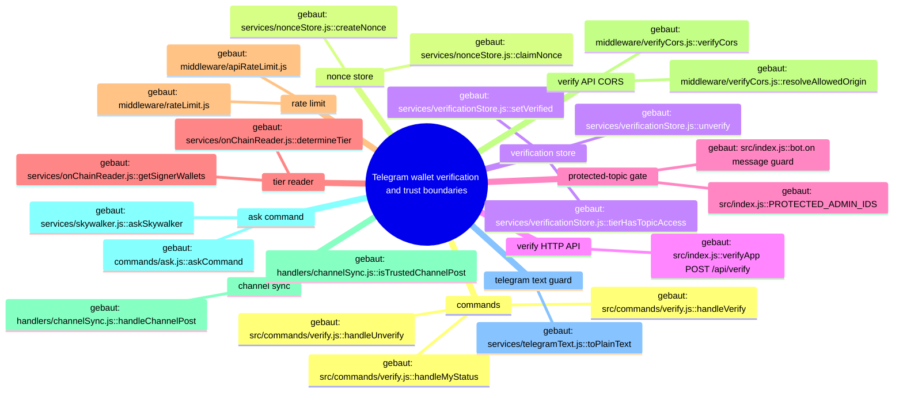

# Architecture Map — Telegram Bot Security Traces

Scope: the verification/authorization trace and the privilege/CORS/content-trust
traces inside `apps/telegram/telegram-bot` (tasks
INFERNO-SECURITY-S2A-TELEGRAM-STATUS-20260926,
INFERNO-SECURITY-S2B-TELEGRAM-IDENTITY-20260926 and
INFERNO-SECURITY-S2C-TELEGRAM-TRUST-20260926, integrated on one base).
The rest of the repository is intentionally unmapped.

## 1. Grundidee

The IFR Telegram bot gates protected forum topics (Core Dev, Council, Vote, Dev & Builder)
by binding a Telegram account to an Ethereum wallet: the bot issues a single-use nonce in
private chat, the user signs it on `ifrunit.tech/wiki/verify.html`, and the bot's Express
API checks the signature and stores the binding (`apps/telegram/telegram-bot/README.md`,
`apps/telegram/telegram-bot/src/index.js`). A per-message guard in protected threads then
allows or deletes messages based on the wallet's on-chain tier
(`apps/telegram/telegram-bot/src/services/verificationStore.js`,
`apps/telegram/telegram-bot/src/services/onChainReader.js`).

The same bot publishes generated or external content into the community (`/ask` AI
answers, channel → community sync with auto-pin). Both directions — privilege granting
and content publishing — fail closed: no hardcoded fallback identities, no substring
origin checks, no untrusted markup, no pins of untrusted channel content
(`src/index.js`, `src/services/onChainReader.js`).

## 2. Spur (Hop-Liste)

Verification/authorization trace:

1. `src/index.js::bot.command('verify')` → `src/commands/verify.js::handleVerify` — Daten: Telegraf `ctx` (userId, chat type)
2. `commands/verify.js::handleVerify` → `services/nonceStore.js::createNonce` — Daten: userId → nonce string
3. Browser (verify.html) → Traefik (TLS, ein Proxy-Hop, trusted via `VERIFY_TRUST_PROXY`) → `src/index.js::verifyApp POST /api/verify` — Daten: `{ nonce, signature, wallet }` + client IP via X-Forwarded-For
4. `src/index.js::POST /api/verify` → `services/nonceStore.js::claimNonce` (atomar vor jedem await) + `services/verificationStore.js::setVerified` — Daten: nonce → userId; binding userId → wallet
5. `src/index.js::POST /api/verify` → `services/onChainReader.js::determineTier` — Daten: wallet → tier (signer/voter/builder/community)
6. group message → `src/index.js::protected-topic guard (bot.on('message'))` → `services/verificationStore.js::{getWallet, reverifyFromMap}` + `services/onChainReader.js::determineTier` + `services/verificationStore.js::tierHasTopicAccess` — Daten: userId, threadId → allow/delete
7. `src/index.js::bot.command('unverify')` → `src/commands/verify.js::handleUnverify` → `services/verificationStore.js::unverify` — Daten: userId → binding removed
8. `commands/verify.js::handleMyStatus` → `services/verificationStore.js::{getUser, hasTopicAccess}` — Daten: userId → display only, no authorization

Trust-boundary trace:

1. config (`ADMIN_USER_IDS`, `SIGNER_WALLETS`, Safe RPC) →
   `src/index.js::PROTECTED_ADMIN_IDS` + `src/services/onChainReader.js::getSignerWallets` —
   Daten: env/on-chain owners → admin bypass list / signer tier set. Missing
   config or RPC failure yields an empty set (fail closed), never a hardcoded identity.
2. browser `Origin` header → `src/middleware/verifyCors.js::verifyCors` →
   `src/index.js::verifyApp` — Daten: origin string → exact allowlisted
   `Access-Control-Allow-Origin` or none. Requests without an Origin header are
   processed as non-browser API clients and receive no CORS headers.
3. `channel_post` update → `src/handlers/channelSync.js::handleChannelPost` →
   `ctx.telegram.sendMessage` + `pinChatMessage` — Daten: channel text →
   plain-text community message, pinned. Only the explicitly configured
   `TELEGRAM_CHANNEL_ID` source is trusted; forwarded/spoofed/missing source
   metadata fails closed.
4. `/ask` command → `src/commands/ask.js::askCommand` →
   `src/services/skywalker.js::askSkywalker` →
   `src/services/telegramText.js::toPlainText` → `editMessageText` — Daten:
   LLM answer string → plain-text Telegram message ≤ 4096 chars, no parse_mode.

## 3. Module

| Modul | Eine Aufgabe | Einstieg | Stand |
| --- | --- | --- | --- |
| telegram-bot commands | `/verify`, `/unverify`, `/mystatus` user entry | `src/commands/verify.js::handleVerify` | gebaut |
| nonce store | single-use CSPRNG codes, atomic claim, TTL | `src/services/nonceStore.js::createNonceStore` | gebaut |
| verification store | userId↔wallet binding, persistence, topic matrix | `src/services/verificationStore.js` | gebaut |
| verify HTTP API | wallet-signature check, binding write, trust-proxy policy, API rate limit | `src/index.js::verifyApp` | gebaut |
| protected-topic gate | per-message authorization in protected threads, registered before command handlers, fail-closed admin bypass | `src/index.js::bot.on('message')` | gebaut |
| tier reader | on-chain tier derivation (Safe owners, IFRLock, BuilderRegistry), fail-closed signer set | `src/services/onChainReader.js::determineTier` | gebaut |
| rate limit (bot) | per-user command throttle keyed on Telegram user id | `src/middleware/rateLimit.js` | gebaut |
| rate limit (HTTP) | per-IP throttle for the verify API keyed on req.ip | `src/middleware/apiRateLimit.js` | gebaut |
| verify API CORS | exact HTTPS origin allowlist for the verify API | `src/middleware/verifyCors.js::verifyCors` | gebaut |
| channel sync | trusted channel → community repost + auto-pin, plain text | `src/handlers/channelSync.js::handleChannelPost` | gebaut |
| ask command | AI answer delivered as untrusted plain text | `src/commands/ask.js::askCommand` | gebaut |
| telegram text guard | control-char strip + 4096 truncation for outbound text | `src/services/telegramText.js::toPlainText` | gebaut |
| AI service | LLM answer source (rate-limited, 500-char input cap) | `src/services/skywalker.js::askSkywalker` | gebaut |

## 4. Verdrahtung

- `/verify` (private chat only) mints a CSPRNG nonce bound to the Telegram user id.
- `POST /api/verify` claims the nonce atomically (validate + delete before any await — burned
  even on downstream failure, fail closed), verifies
  `ethers.verifyMessage(nonce, signature) == wallet`, derives the tier on-chain and stores
  userId→wallet (unique per wallet).
- The API runs behind Traefik; `trust proxy` is pinned to the proxy hop (`VERIFY_TRUST_PROXY`,
  default Docker pool `172.16.0.0/12`) so the per-IP limiter keys on the real client IP, while
  a direct untrusted peer's forwarding header stays ignored.
- The topic guard runs before any command handler; on every protected message it re-derives
  the tier live from chain and never consults stored tier metadata for authorization.
- `/unverify` (Telegram-authenticated) deletes the binding from memory and the persisted map.
- `PROTECTED_ADMIN_IDS` is parsed from `ADMIN_USER_IDS`; an unset or unparsable
  env yields an empty list, so the topic gate's admin bypass has no implicit member.
- `getSignerWallets()` reads Gnosis Safe owners; on RPC failure it returns the
  explicitly configured `SIGNER_WALLETS` list or `[]` — there is no built-in
  fallback identity (CWA-38).
- `verifyCors` parses the Origin header as a URL and accepts only the exact
  serialized origins `https://ifrunit.tech` / `https://www.ifrunit.tech`
  (scheme https, no credentials, no non-default port, no path/query/hash).
  Preflights and responses for any other origin carry no CORS headers (CWA-39).
- `handleChannelPost` trusts only `TELEGRAM_CHANNEL_ID` (numeric chat id or
  `@username`), rejects forwarded/relayed posts and posts sent on behalf of a
  foreign chat, sends the text as plain text (no `parse_mode`) and pins only
  after a successful send to the configured community group (CWA-45).
- `askCommand` sends the AI answer through `toPlainText` with the Telegram
  4096-character limit and no Markdown/HTML parsing (CWA-45).

## 5. Widerspruch und Lücken

- `GET /api/verify/status/:userId` (CWA-34) is removed; the regression test
  `apps/telegram/telegram-bot/test/verify-api-status-route.test.js` guards the absence.
- Stored `user.tier` remains as display data for `/mystatus` only; it is not an authorization
  source (CWA-44).
- Telegram sets `sender_chat` to the channel itself on genuine channel posts, so a
  blanket `sender_chat` drop would silently disable the sync; the trusted path is
  explicit (`isTrustedChannelPost`) instead of accidental.
- Signer tier during a Safe RPC outage without `SIGNER_WALLETS` degrades to
  `community` for everyone — deliberate fail-closed availability trade-off.

## 6. Diagrammdateien

- `docs/architecture/map.puml`
- `docs/architecture/main-path.puml`
- (`plantuml` not available in PATH — sources only, Mermaid mindmap below)

```mermaid
mindmap
  root((Telegram wallet verification and trust boundaries))
    commands
      gebaut: src/commands/verify.js::handleVerify
      gebaut: src/commands/verify.js::handleUnverify
      gebaut: src/commands/verify.js::handleMyStatus
    nonce store
      gebaut: services/nonceStore.js::createNonce
      gebaut: services/nonceStore.js::claimNonce
    verification store
      gebaut: services/verificationStore.js::setVerified
      gebaut: services/verificationStore.js::unverify
      gebaut: services/verificationStore.js::tierHasTopicAccess
    verify HTTP API
      gebaut: src/index.js::verifyApp POST /api/verify
    protected-topic gate
      gebaut: src/index.js::bot.on message guard
      gebaut: src/index.js::PROTECTED_ADMIN_IDS
    tier reader
      gebaut: services/onChainReader.js::determineTier
      gebaut: services/onChainReader.js::getSignerWallets
    rate limit
      gebaut: middleware/rateLimit.js
      gebaut: middleware/apiRateLimit.js
    verify API CORS
      gebaut: middleware/verifyCors.js::resolveAllowedOrigin
      gebaut: middleware/verifyCors.js::verifyCors
    channel sync
      gebaut: handlers/channelSync.js::isTrustedChannelPost
      gebaut: handlers/channelSync.js::handleChannelPost
    ask command
      gebaut: commands/ask.js::askCommand
      gebaut: services/skywalker.js::askSkywalker
    telegram text guard
      gebaut: services/telegramText.js::toPlainText
```

## 7. Nächster Schritt

Modul: verification store + topic gate. Hop 6 der Verification-Spur (guard re-derives
tier live). Unberührt bleiben: `services/moderation.js`, `services/onchain.js`, alle
anderen Commands, Deployment-Dateien und das oeffentliche CWA-Register.
