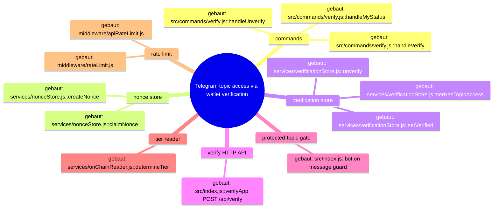

# Architecture Map — Telegram Bot Verification Trace

Scope: only the `/verify` → verification-storage → topic-gate → tier-lookup trace inside
`apps/telegram/telegram-bot` (task INFERNO-SECURITY-S2B-TELEGRAM-IDENTITY-20260926).
The rest of the repository is intentionally unmapped.

## 1. Grundidee

The IFR Telegram bot gates protected forum topics (Core Dev, Council, Vote, Dev & Builder)
by binding a Telegram account to an Ethereum wallet: the bot issues a single-use nonce in
private chat, the user signs it on `ifrunit.tech/wiki/verify.html`, and the bot's Express
API checks the signature and stores the binding (`apps/telegram/telegram-bot/README.md`,
`apps/telegram/telegram-bot/src/index.js`). A per-message guard in protected threads then
allows or deletes messages based on the wallet's on-chain tier
(`apps/telegram/telegram-bot/src/services/verificationStore.js`,
`apps/telegram/telegram-bot/src/services/onChainReader.js`).

## 2. Spur (Hop-Liste)

1. `src/index.js::bot.command('verify')` → `src/commands/verify.js::handleVerify` — Daten: Telegraf `ctx` (userId, chat type)
2. `commands/verify.js::handleVerify` → `services/nonceStore.js::createNonce` — Daten: userId → nonce string
3. Browser (verify.html) → Traefik (TLS, ein Proxy-Hop, trusted via `VERIFY_TRUST_PROXY`) → `src/index.js::verifyApp POST /api/verify` — Daten: `{ nonce, signature, wallet }` + client IP via X-Forwarded-For
4. `src/index.js::POST /api/verify` → `services/nonceStore.js::claimNonce` (atomar vor jedem await) + `services/verificationStore.js::setVerified` — Daten: nonce → userId; binding userId → wallet
5. `src/index.js::POST /api/verify` → `services/onChainReader.js::determineTier` — Daten: wallet → tier (signer/voter/builder/community)
6. group message → `src/index.js::protected-topic guard (bot.on('message'))` → `services/verificationStore.js::{getWallet, reverifyFromMap}` + `services/onChainReader.js::determineTier` + `services/verificationStore.js::tierHasTopicAccess` — Daten: userId, threadId → allow/delete
7. `src/index.js::bot.command('unverify')` → `src/commands/verify.js::handleUnverify` → `services/verificationStore.js::unverify` — Daten: userId → binding removed
8. `commands/verify.js::handleMyStatus` → `services/verificationStore.js::{getUser, hasTopicAccess}` — Daten: userId → display only, no authorization

## 3. Module

| Modul | Eine Aufgabe | Einstieg | Stand |
| --- | --- | --- | --- |
| telegram-bot commands | `/verify`, `/unverify`, `/mystatus` user entry | `src/commands/verify.js::handleVerify` | gebaut |
| nonce store | single-use CSPRNG codes, atomic claim, TTL | `src/services/nonceStore.js::createNonceStore` | gebaut |
| verification store | userId↔wallet binding, persistence, topic matrix | `src/services/verificationStore.js` | gebaut |
| verify HTTP API | wallet-signature check, binding write, trust-proxy policy, API rate limit | `src/index.js::verifyApp` | gebaut |
| protected-topic gate | per-message authorization in protected threads, registered before command handlers | `src/index.js::bot.on('message')` | gebaut |
| tier reader | on-chain tier derivation (Safe owners, IFRLock, BuilderRegistry) | `src/services/onChainReader.js::determineTier` | gebaut |
| rate limit (bot) | per-user command throttle keyed on Telegram user id | `src/middleware/rateLimit.js` | gebaut |
| rate limit (HTTP) | per-IP throttle for the verify API keyed on req.ip | `src/middleware/apiRateLimit.js` | gebaut |

## 4. Verdrahtung

- `/verify` (private chat only) mints a CSPRNG nonce bound to the Telegram user id.
- `POST /api/verify` claims the nonce atomically (validate + delete before any await — burned
  even on downstream failure, fail closed), verifies
  `ethers.verifyMessage(nonce, signature) == wallet`, derives the tier on-chain and stores
  userId→wallet (unique per wallet).
- The API runs behind Traefik; `trust proxy` is pinned to the proxy hop (`VERIFY_TRUST_PROXY`,
  default Docker pool `172.16.0.0/12`) so the per-IP limiter keys on the real client IP, while
  a direct untrusted peer's forwarding header stays ignored.
- The topic guard runs before any command handler; on every protected message it re-derives
  the tier live from chain and never consults stored tier metadata for authorization.
- `/unverify` (Telegram-authenticated) deletes the binding from memory and the persisted map.

## 5. Widerspruch und Lücken

- `GET /api/verify/status/:userId` (CWA-34) is removed by S2A on
  `agent/claude/INFERNO-SECURITY-S2A-TELEGRAM-STATUS-20260926`; the route still exists on this
  branch's base and is deliberately left untouched here to keep the merge clean.
- Stored `user.tier` remains as display data for `/mystatus` only; it is not an authorization
  source (CWA-44).

## 6. Diagrammdateien

- `docs/architecture/map.puml`
- `docs/architecture/main-path.puml`
- (`plantuml` not available in PATH — sources only, Mermaid mindmap below)

```mermaid
mindmap
  root((Telegram topic access via wallet verification))
    commands
      gebaut: src/commands/verify.js::handleVerify
      gebaut: src/commands/verify.js::handleUnverify
      gebaut: src/commands/verify.js::handleMyStatus
    nonce store
      gebaut: services/nonceStore.js::createNonce
      gebaut: services/nonceStore.js::claimNonce
    verification store
      gebaut: services/verificationStore.js::setVerified
      gebaut: services/verificationStore.js::unverify
      gebaut: services/verificationStore.js::tierHasTopicAccess
    verify HTTP API
      gebaut: src/index.js::verifyApp POST /api/verify
    protected-topic gate
      gebaut: src/index.js::bot.on message guard
    tier reader
      gebaut: services/onChainReader.js::determineTier
    rate limit
      gebaut: middleware/rateLimit.js
      gebaut: middleware/apiRateLimit.js
```

## 7. Nächster Schritt

Modul: verification store + topic gate. Hop 6 (guard re-derives tier live). Unberührt
bleiben: `services/moderation.js`, `services/onchain.js`, alle anderen Commands, die
S2A-Status-Route.
