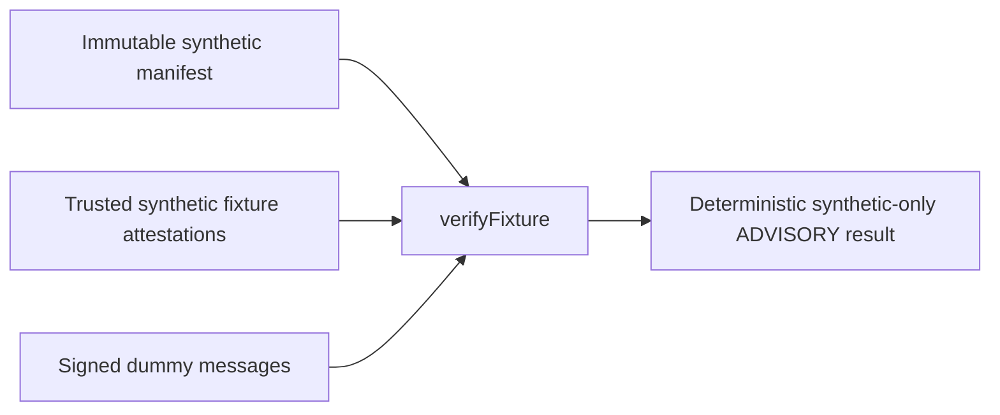

# Disabled Forum Synthetic Fixture Verifier

## Boundary And Map

This source-only slice implements the OPEN Forum verification node accepted in
`COUNCIL-FORUM-COMPLETION-MAP-20261010.md` and
`FORUM-ENGINE-COMPATIBILITY-20261010.md`. It does not change Council verification,
collect ballots, contact Snapshot/Hub/RPC, authenticate chain state, or authorize
governance. Real DIP outcomes remain ADVISORY; O1/O2 remain open.

| Module | Entry | Hop | State |
| --- | --- | --- | --- |
| Synthetic Forum verification | `scripts/verify-forum-votes.cjs::verifyFixture` | manifest + separately injected trusted synthetic evidence + signed dummy votes -> exact fixture tally | source implementation; NOT RUN |
| Synthetic regression source | `scripts/test-forum-votes.cjs` | dummy fixtures -> assertions over the pure verifier | source implementation; NOT RUN |
| CI admission | `.github/workflows/forum-fixture.yml` -> `scripts/run-forum-fixture-ci.sh` | trusted bounded acquisition + effective isolation proofs -> existing regression entry | SOURCE GO; NOT RUN |



The verifier implementation boundary remains these two scripts and this document.
The separate CI-admission boundary adds only the dedicated workflow and trusted
driver named above. Existing maps, Council data, apps, package/locks, SDK CI and
live governance remain untouched. The admission controls below are recorded
before the CI implementation, under the parent's source-only authorization.

### CI Admission Controls

The new hop is the dedicated GitHub-hosted `ubuntu-24.04` job -> trusted driver
-> existing fixture regression -> unchanged pure verifier. The job has only
`contents: read`, checkout credentials disabled and no secrets, id-token,
publication, cache/artifact actions, self-hosted runner or deployment. Source GO
does not authorize local Docker, downloads, installation, syntax checks or tests.

The tool image is the named Node RepoDigest
`docker.io/library/node@sha256:0a7108bf6c7bf5de370ffb1a3ed6be93d405b43ff159f681a8d18c0e2bc2e402`,
Linux/amd64, Node **22.23.3**. CI must prove RepoDigest, platform, image identity
and actual Node version, not substitute an available tool. Host prerequisites
are explicit absolute-path Bash, Docker, GNU coreutils and curl, with no installer
fallback. Docker uses only `unix:///var/run/docker.sock`, a private empty config
and cleared environment; inherited contexts, TLS settings and remote endpoints
cannot redirect it. No container receives a Docker socket or host HOME.

Trusted acquisition is a new bounded hosted-CI phase, separate from target
execution. Both containers have network/IPC disabled, read-only roots and
read-only inert Docker-injected hosts/hostname/resolver files, UID/GID 10000,
all capabilities dropped, seccomp and no-new-privileges. Acquisition has one
CPU, 512 MiB RAM/no swap, PIDs 64, FDs 64, an 8 MiB regular-file limit, a private
128 MiB tmpfs work volume and 16 MiB scratch. Its HOME/cache are private quota
storage; staged SDK manifest/lock are read-only. It receives no hooks, build,
profile, credential, proxy or host environment.

The only dependency network requests are trusted host curl requests to exact
`https://registry.npmjs.org/` tarball URLs from the existing SDK lock, with
redirects/proxies/config/retries disabled and per-request/phase deadlines.
Downloads stream directly into acquisition quota storage, capped at 8 MiB each
and verified against the lock's SHA-512 before offline npm cache admission.
The digest-only image pull is separately bounded trusted tool bootstrap.
`npm ci --offline --omit=dev --ignore-scripts --no-audit --no-fund` uses the
unchanged lock; no SDK build or fixture import occurs during acquisition.

Export uses the owned quota-backed Docker volume's `node_modules` subpath,
mounted read-only into the target, not a host-extracted archive. Only the nine
lock-pinned production packages are admitted, with ethers **6.17.0**; all tree
entries must be ordinary directories/files, with no symlink, special file,
path traversal, unknown package or excess depth/count/size. Closure size is
capped at 32 MiB and entries at 8192, then files/directories are sealed read-only.
No archive is generated or extracted on the host, and npm HOME/cache are not
exported. Unsupported quota or volume-subpath behavior fails closed.

Target limits remain one CPU, 256 MiB RAM/no swap, PIDs 64, FDs 64, 1 MiB files
and private 16 MiB scratch. Only the two staged source files, sealed tools
subpath and inert injected files are mounted, all read-only except scratch.
Before npm acquisition or any target import, trusted preflight checks Docker
configuration and effective namespaces, UID/capabilities/seccomp/NNP,
cgroup-v2 limits, rlimits, mount flags, quotas and empty/minimal process env.
Import admission is bounded to 30s, CLI refusal to 30s and fixtures to 120s.
Success requires the exact negative CLI exit 1/refusal and fixture exit 0 with
the existing exact PASS line. Preflight exit 98, missing tests/markers,
timeouts or unexpected output remain failures, never PASS.

The acquisition phase uses a 180s budget and PID1 proposes a 240s target
lifetime; timer signal isolation and daemon-side termination remain unverified.
External client/driver deadlines are independent of the target namespace:
image pull 120s, driver 600s and job 12 minutes. Expiration refuses admission. Captured
text output is aggregate-bounded at 64 KiB; binary
downloads are independently bounded and never logged. Cleanup targets only
this invocation's owner-labelled containers/volume and private temporary
directory. Cleanup also matches recorded created IDs, not just names/labels.
Failed or uncertain cleanup prevents PASS and retains private recovery state;
no foreign process, container, volume or shared image is killed/pruned.
The source cleanup review is CLEAR; runtime and CI evidence remain **NOT RUN**.

## Exact Schema

Every object has exactly the listed own enumerable data fields: no extras,
accessors, symbols, custom prototypes, sparse arrays, or cycles. Inputs are
ordinary inert JSON-shaped data, not executable objects/Proxies. Strings are
bounded ASCII (proposal text permits LF); identifiers use `[A-Za-z0-9_-]`.
Addresses are nonzero 20-byte hex, validated with ethers `getAddress`, then
lowercased. Hashes are exactly lowercase `0x` + 64 hex digits. Every integer is
a canonical unsigned decimal string, at most uint256; no Number, exponent,
leading zero, whitespace, sign, fraction, or coercion. IFR weights are raw
10^-9 IFR units. Array maxima: 16 choices, 32 contracts, 128 voters, 512 claims,
256 votes/receipts/1271 attestations. Text maxima: title/label 256 characters,
proposal text 32768, IDs/version 64; signatures at most 4096 bytes. Depth <= 12,
nodes <= 24000, cumulative string characters <= 4000000. These are format
bounds, not ballot policy defaults.

`verifyFixture(fixture, trustedEvidence)` is synchronous, pure, and nonmutating.
`trustedEvidence` is a separate explicit argument from the trusted synthetic
fixture author; its claims are not established by signatures or this verifier.

```text
fixture = { profile: "synthetic-only", manifest, votes: [vote] }
manifest = {
  schema: "forum-fixture-v1",
  domain: { name: "IFR Forum Synthetic Fixture", version: "1",
            chainId: uint, verifyingContract: address, salt: hash },
  ballotId: id,
  proposal: { id, version: id, title: text, text: textWithLF },
  choices: [{ id, label: text }],
  snapshot: { chainId: uint, height: uint, blockHash: hash },
  approvedContracts: [address], voters: [{ wallet: address, kind: "EOA"|"EIP1271" }],
  lockEvidenceHash: hash,
  policy: {
    selection: "first-only"|"last-valid", order: "contiguous-receipt-v1",
    start: uint, cutoff: uint, delegation: "disabled", tie: "no-winner",
    quorum: { basis: "eligible-weight"|"explicit-weight", weight: uint,
              numerator: uint, denominator: uint, comparison: "gte"|"gt" },
    threshold: { basis: "cast-weight", numerator: uint, denominator: uint,
                 comparison: "gte"|"gt" },
    abstain: { choice: id, quorum: "include"|"exclude", threshold: "include"|"exclude" }
  }
}
vote = {
  domain, manifestHash: hash, ballotId: id, proposalHash: hash,
  chainId: uint, snapshotHeight: uint, snapshotHash: hash,
  wallet: address, kind: "EOA"|"EIP1271", choice: id,
  messageId: hash, nonce: uint, order: uint, signature: hexBytes
}
trustedEvidence = {
  profile: "synthetic-only", manifestHash: hash, snapshot,
  locks: [{ claimId: hash, contract: address, owner: address, weight: uint }],
  receipts: [{ order: uint, messageId: hash, digest: hash }],
  cutoff: { kind: "synthetic-complete-order-attestation-v1", complete: true,
            start: uint, end: uint, count: uint },
  contractAttestations: [{ kind: "synthetic-eip1271-attestation-v1",
    wallet: address, chainId: uint, height: uint, blockHash: hash,
    digest: hash, signatureHash: hash, magicValue: "0x1626ba7e" }]
}
```

All policy fields are mandatory; unknown policy fails closed. At least two
choices (one non-abstain), one voter and contract are required. Snapshot and
domain chains must agree and be positive. Lock weights are positive; all owners
and contracts must be registered. Claim IDs are globally unique, including
across contracts: overlapping claims reject the entire fixture, never count
twice or choose an arbitrary representative. Sum weights linearly per canonical
voter; changing claim partition without changing per-owner totals leaves tallies
unchanged after regenerating the frozen hashes and dummy signatures.

## Canonical Hash And Signing Recipe

Use ethers **6.17.0** only: `keccak256`, `toUtf8Bytes`, `getAddress`,
`TypedDataEncoder.hash`, `verifyTypedData`. No handwritten cryptography.
Canonical JSON recursively sorts object keys in ASCII order, preserves scalar
types, uses `JSON.stringify` escaping, and has no whitespace. First normalize
addresses; sort choices by ID, contracts by address, voters by wallet, locks by
claimId, receipts by numeric order, and attestations by digest. Numeric values
remain strings. Array permutations of these sets are not manifest edits.

1. `proposalHash = keccak256(UTF8(canonicalJSON(proposal)))` binds every proposal
   byte, ID, version and title, not a URL.
2. `lockEvidenceHash = keccak256(UTF8(canonicalJSON({profile:"synthetic-only",
   snapshot, locks})))` binds the exact synthetic lock claims/state recipe.
3. `manifestHash = keccak256(UTF8(canonicalJSON(normalizedManifest)))` binds all
   identities, contracts, full proposal, choices, domain, snapshot, lock hash,
   and all policy settings. Any setting change requires new signatures.
4. EIP-712 domain is exactly `manifest.domain`, including the fixture-only name,
   version, explicit chain, nonzero verifyingContract and explicit salt. The
   sole primary type is `SyntheticForumVote` with fields in this exact order:
   `manifestHash bytes32`, `ballotId string`, `proposalHash bytes32`,
   `chainId uint256`, `snapshotHeight uint256`, `snapshotHash bytes32`,
   `wallet address`, `kind string`, `choice string`, `messageId bytes32`,
   `nonce uint256`, `order uint256`. The typed value is the vote minus `domain`
   and `signature`. Both duplicated bindings and domain must equal the manifest.
5. `digest = TypedDataEncoder.hash(domain, types, value)`. Each receipt binds
   this digest, message ID, and signed order. `signatureHash = keccak256` of the
   exact signature bytes binds synthetic EIP-1271 attestations to the payload.
6. Output `evidenceHash` hashes the normalized full trustedEvidence, including
   receipts, cutoff assertion and contract attestations. No timestamp or
   environment-dependent value enters the output.

## Selection And Exact Tally

The acceptance interval is half-open `[start, cutoff)`. It must contain exactly
the supplied vote/receipt count (<=256) with contiguous unique signed orders.
The separate synthetic cutoff attestation must explicitly assert `complete:true`
and match start/end/count. There is no sorting by claimed wall clock or array
position and no silent omission of invalid or late records. Message IDs and
digests are globally unique. Per-voter nonces start at zero and increment by one
in receipt order; reused/skipped/decreasing nonces fail. All submitted signatures
must validate before first-only or last-valid selection. First-only chooses the
earliest valid record; last-valid chooses the latest valid record.

Quorum denominator is the required positive `quorum.weight`; for eligible-weight
it must equal the exact sum of all eligible lock weights. Explicit-weight is a
trusted synthetic policy parameter, not an inferred supply. Quorum numerator is
selected cast weight, excluding abstain only when explicitly requested.
Threshold denominator is selected cast weight, excluding abstain only when
explicitly requested. Fractions require `0 <= numerator <= denominator` and
`denominator > 0`; compare `actual * denominator` with `basis * numerator` using
only BigInt and the explicitly chosen `gt` or `gte`. A zero actual basis never
passes. A unique highest non-abstain choice wins only the synthetic fixture when
both comparisons pass; a tie yields null, not lexical tie-breaking. There is no
adoption/execution outcome. Outputs use decimal strings, choices sorted by ID,
final votes sorted by wallet, and claims sorted by ID. No input mutation.

## Trust, Failure And Execution

EOA recovery establishes only the signature-to-listed-dummy-wallet binding.
EIP-1271 uses **only** the explicitly injected
`synthetic-eip1271-attestation-v1`, matching wallet, chain, height, blockHash,
typed digest, exact signatureHash and expected magic. No EOA fallback, contract
call, or real chain verification is permitted. Missing/duplicate/unused/unknown
attestations fail. Registry kind is frozen and signed, not selected by recovery.
Snapshot/lock truth and completeness/order are trusted **synthetic assertions**;
the verifier cannot prove them. Caller-controlled evidence is not authenticity.

Every verifier result and direct-execution refusal contains
`profile:"synthetic-only"`, `authority:"ADVISORY"`, `productionReady:false`,
`chainEvidenceVerified:false`. Invalid input yields only those markers,
`status:"rejected"`, and constant `error:"FIXTURE_REJECTED"`; no partial tally,
winner, attacker-controlled error text, adoption or readiness. The single error
code also makes invalid results independent of array permutation.

Exports are the pure verifier only. Direct execution ignores arguments, reads no
files, and prints a fixed `OFFLINE_API_ONLY` refusal with the same trust markers
and nonzero exit status, without loading ethers. There is no file-intake CLI,
provider, signer in verifier source, network, database, clock, random source or
service process. Tests generate signatures using public dummy scalar keys only;
they must run only in the parent's OS-confined Linux runner. The separate
hosted-CI acquisition recipe above does not authorize workstation execution,
installation, downloads or target builds.

Open hops: independently authenticated historical chain/state proofs and order
completeness; real EIP-1271 execution; ratified policy/O1/O2; intake, identity,
privacy, release, activation and governance execution. None is implemented here.
Source delivery is not an acceptance PASS. Parent owns isolated test execution,
independent security review and integration; do not archive this worktree until
that evidence and source have been retained by the parent.
